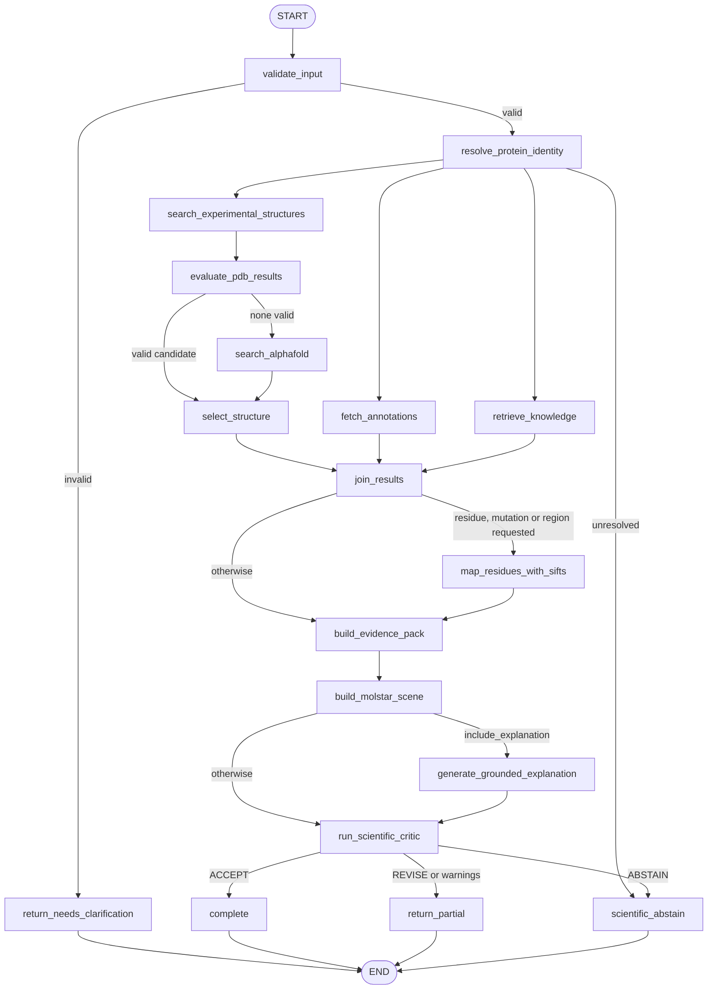

# Protein analysis workflow

The sub-orchestrator runs a LangGraph `StateGraph`
([app/orchestrators/protein/graph.py](../app/orchestrators/protein/graph.py)). The
next node is chosen from the state, not from a fixed list.

## Where the decisions are made

| Decision | Location |
|---|---|
| Input is answerable | `validate_input` — otherwise `NEEDS_CLARIFICATION` |
| Identity is the anchor | `route_after_identity` — no identity, no structure |
| Parallel evidence gathering | `route_after_identity` returns three nodes at once |
| A PDB entry is usable | `StructureNodes.evaluate_pdb` (chain, coverage floor, metadata) |
| AlphaFold is needed | `route_after_pdb_evaluation` — fallback only |
| Which structure wins | `StructureCapability.select` — deterministic scores, never the LLM |
| SIFTS is needed | `route_mapping_required` — residue, mutation or region requested |
| The result is publishable | `run_scientific_critic` → `route_after_critic` |

## Failure behaviour

`join_results` is deferred, so it runs once all branches have settled. Every
optional node converts a provider failure into a coded warning
(`PDB_TIMEOUT`, `ANNOTATIONS_UNAVAILABLE`, `RETRIEVAL_UNAVAILABLE`,
`SIFTS_UNAVAILABLE`, `LLM_UNAVAILABLE`, …) and the workflow continues with the
evidence it has, ending in `PARTIAL`. Only an unresolved identity stops it.

A residue is highlighted only when SIFTS reports it observed; otherwise the scene
omits it, a warning is raised, and the critic downgrades the verdict to `REVISE`
or `ABSTAIN`. An AlphaFold model is always reported as `PREDICTED`.
