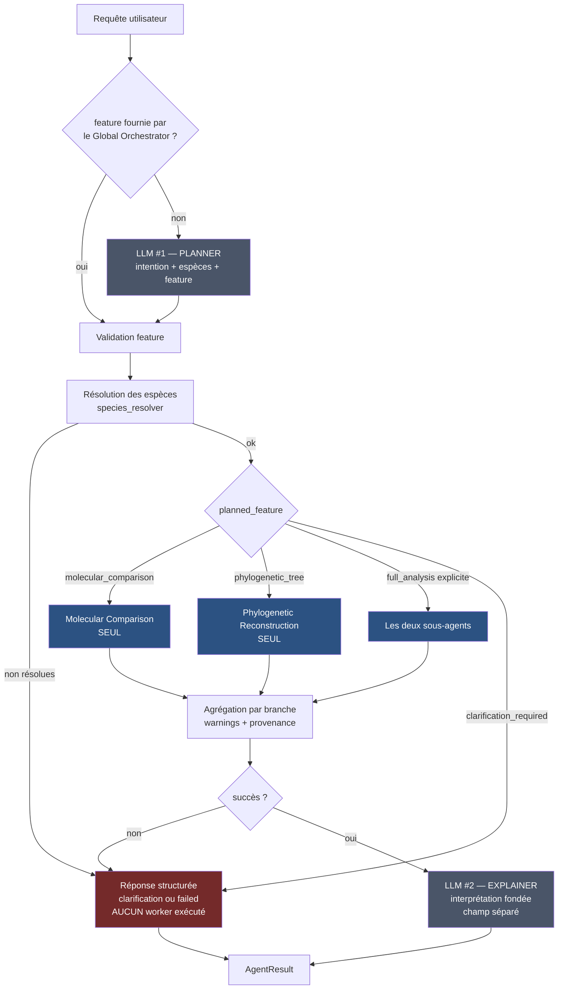

# Evolution Agent — Plan de correction vers l'autonomie (providers mockés)

**Destinataire** Ahmed Omar Dridi · **Branche** `group_d_evolution_agent` · **Base** `49540bd`
**Statut** plan technique — aucune ligne de code de production n'a été modifiée.

Ce document décrit **quoi** changer, **où**, et **comment le prouver**. Il ne contient aucune correction appliquée.

---

## 0. Point de départ

Ce qui fonctionne déjà et qu'il ne faut pas casser :

| Acquis | Emplacement |
|---|---|
| Classification d'intention correcte (3/3 en live Azure) | [intent.py:161](intent.py) `classify_intent` |
| Deux sous-agents structurellement séparés, schémas disjoints | [workers/molecular_comparison/mock.py](workers/molecular_comparison/mock.py), [workers/phylogenetic_tree/mock.py](workers/phylogenetic_tree/mock.py) |
| Mocks déterministes, conformes aux schémas, erreurs simulées | 33/33 tests `test_mock_quality_audit.py` |
| Résolution de noms communs → noms scientifiques | [orchestrator/services/species_resolver.py](orchestrator/services/species_resolver.py) |
| Contrat HTTP tenu, jamais de 500 sur erreur métier | [api.py:132](api.py) |
| Client LLM Azure fonctionnel | [framework/llm_client.py:50](framework/llm_client.py) `get_llm` |

Le seul maillon manquant : **entre la décision et l'exécution**. Le Planner décide, l'orchestrateur ignore la décision.

```python
# orchestrator/evolution_orchestrator.py:244-247  ← la racine du problème
mc_result, phylo_result = await asyncio.gather(
    call(self._mc_worker),
    call(self._phylo_worker),
)
```

`state.planned_feature` est écrit en [:189](orchestrator/evolution_orchestrator.py) et **relu par aucun nœud**.

---

## 1. Workflow cible



**Budget LLM : 2 appels maximum par requête.**

| Scénario | Planner | Explainer | Total |
|---|---|---|---|
| Branche exécutée avec succès | 1 | 1 | **2** |
| `feature` fournie par le Global Orchestrator + succès | 0 | 1 | **1** |
| Clarification requise | 1 | 0 | **1** |
| Échec de worker / précondition | 1 | 0 | **1** |
| Planner indisponible | 1 (échouée) | 0 | **1** |

---

## 2. Appel LLM #1 — Planner

### 2.1 Fichier

Refondre [intent.py](intent.py) (205 lignes). Conserver `_extract_json` ([:93](intent.py)), `_clean_str` ([:123](intent.py)), `_clean_list` ([:132](intent.py)) — ils sont robustes et déjà testés. Remplacer `RecognizedIntent`, `_to_intent` et `classify_intent`.

Renommage recommandé : `intent.py` → `planner.py`, avec un ré-export dans `intent.py` le temps de la migration pour ne pas casser `test_adapter.py`.

### 2.2 Contrat de sortie

```python
# schema.py — ajouter près de EvolutionaryFeature (ligne 39)
class PlannedFeature(str, Enum):
    MOLECULAR_COMPARISON  = "molecular_comparison"
    PHYLOGENETIC_TREE     = "phylogenetic_tree"
    FULL_ANALYSIS         = "full_analysis"
    CLARIFICATION_REQUIRED = "clarification_required"
```

> `EvolutionaryFeature` ([schema.py:39-41](schema.py)) reste le **contrat des workers** (2 membres = 2 sous-agents). `PlannedFeature` est le **contrat du Planner** (4 membres). Ne pas les fusionner : c'est ce qui garantit qu'aucun troisième worker ne peut apparaître par la porte de l'enum.

```python
@dataclass(frozen=True)
class PlannerDecision:
    feature: PlannedFeature
    species_list: list[str]            = field(default_factory=list)
    reference_species: str | None      = None
    clarification_question: str | None = None
    explicitly_requested_both: bool    = False
    source: str                        = "llm"   # llm | llm_unavailable | unparsable | error | rule
```

### 2.3 Prompt système

Réécrire `INTENT_SYSTEM_PROMPT` ([intent.py:39-67](intent.py)). **Supprimer impérativement la ligne 55** :

```
                       Use this when in doubt about which sub-task to run.
```

C'est cette instruction qui transforme toute ambiguïté en double exécution. Prompt cible :

```text
You are the planner of the Evolution Agent (Umbrella BioHub).
Decide what the user is asking for and extract the parameters.

Respond with strict JSON — no prose, no code fences, no extra keys:

{
  "feature": "molecular_comparison" | "phylogenetic_tree"
             | "full_analysis" | "clarification_required",
  "species_list": ["<scientific name>", ...],
  "reference_species": "<outgroup>" | null,
  "explicitly_requested_both": true | false,
  "clarification_question": "<one question>" | null
}

Rules:
- molecular_comparison : sequence similarity, embeddings, similarity network,
                         species grouping/clustering. NOT a tree.
- phylogenetic_tree    : a tree, a phylogeny, branch support, topology.
                         NOT pairwise similarity scores.
- full_analysis        : ONLY when the user explicitly asks for BOTH a
                         similarity network AND a phylogenetic tree in the
                         same request. Set "explicitly_requested_both": true.
- clarification_required : the request is vague, names no species, is not
                         about evolutionary analysis, or you are unsure which
                         of the two results is wanted. Fill
                         "clarification_question" with ONE short question.
                         NEVER guess. NEVER default to full_analysis.
- species_list : every species mentioned, scientific names where possible.
- Output ONLY the JSON.
```

### 2.4 Garde-fous déterministes (post-LLM, hors LLM)

À implémenter dans le remplaçant de `_to_intent` ([intent.py:138](intent.py)). Ce sont des règles Python, pas des consignes au modèle — c'est ce qui rend le comportement testable sans réseau.

| Situation observée | Décision forcée |
|---|---|
| `feature` hors des 4 valeurs | `CLARIFICATION_REQUIRED` |
| `feature == full_analysis` **et** `explicitly_requested_both != true` | `CLARIFICATION_REQUIRED` |
| `feature` valide mais `species_list` vide | `CLARIFICATION_REQUIRED` + question sur les espèces |
| `molecular_comparison` avec < 2 espèces | `CLARIFICATION_REQUIRED` |
| `phylogenetic_tree` avec < 3 espèces | `CLARIFICATION_REQUIRED` (question : ajouter une espèce ou basculer sur une comparaison) |
| LLM indisponible / timeout / JSON illisible | `CLARIFICATION_REQUIRED`, `source` renseigné |

**Règle de sûreté** : le repli est toujours `clarification_required`, **jamais** `full_analysis`. C'est l'inverse exact du comportement actuel.

### 2.5 Diagnostic

Corriger [intent.py:153](intent.py) :

```python
source="llm" if feature else "unparsable"   # ❌ actuel
```

Un modèle qui répond correctement « ce n'est pas une question d'évolution » est aujourd'hui étiqueté `unparsable`, indiscernable d'une panne. Cibler :

```python
source="llm"          # le modèle a répondu et le JSON était valide
source="unparsable"   # le JSON n'a pas pu être extrait
source="error"        # l'appel a levé
source="llm_unavailable"  # aucun backend configuré
```

---

## 3. Routing — la correction centrale

### 3.1 `_plan_node` — [evolution_orchestrator.py:178-189](orchestrator/evolution_orchestrator.py)

État actuel :

```python
feature = (req.context or {}).get("feature") or req.feature or ""
if feature and feature not in self._VALID_FEATURES:
    return {"planned_feature": "__invalid__"}
return {"planned_feature": feature or "full_analysis"}   # ❌ repli interdit
```

Cible : le repli `full_analysis` disparaît. Une feature absente devient `clarification_required`. `_VALID_FEATURES` ([:174-176](orchestrator/evolution_orchestrator.py)) doit être construit sur `PlannedFeature`, pas sur `EvolutionaryFeature | {"full_analysis"}`.

```python
raw = (req.context or {}).get("feature") or req.feature or ""
try:
    planned = PlannedFeature(raw)
except ValueError:
    return {
        "planned_feature": PlannedFeature.CLARIFICATION_REQUIRED,
        "clarification_question": (
            "Would you like a similarity network or a phylogenetic tree?"
        ),
    }
return {"planned_feature": planned}
```

### 3.2 `_route_after_plan` — [:191-192](orchestrator/evolution_orchestrator.py)

Ajouter une sortie `clarify` vers un nouveau nœud `clarify_node` (§5), en plus de `resolve` et de l'actuel `no_feature`.

### 3.3 `_dispatch_node` — [:231-284](orchestrator/evolution_orchestrator.py) — **le cœur du changement**

Remplacer le `asyncio.gather` inconditionnel par une sélection pilotée par `state.planned_feature` :

```python
async def _dispatch_node(self, state: EvolutionState) -> dict:
    req      = state.request
    planned  = state.planned_feature
    warnings: list[str] = []

    async def call(worker) -> AgentResult:
        """Never raises: a worker crash becomes a FAILED AgentResult."""
        try:
            return await asyncio.to_thread(worker.run, req)
        except Exception as exc:
            return AgentResult(
                status=AgentStatus.FAILED,
                output=f"{type(exc).__name__}: {exc}",
            )

    if planned is PlannedFeature.MOLECULAR_COMPARISON:
        mc, phylo = await call(self._mc_worker), None

    elif planned is PlannedFeature.PHYLOGENETIC_TREE:
        mc, phylo = None, await call(self._phylo_worker)

    elif planned is PlannedFeature.FULL_ANALYSIS:
        mc, phylo = await asyncio.gather(
            call(self._mc_worker), call(self._phylo_worker)
        )

    else:                                  # CLARIFICATION_REQUIRED
        return {"needs_clarification": True}

    return self._collect(planned, mc, phylo, warnings)
```

Points d'attention :

- **`call()` ne lève jamais.** C'est ici que se règle le défaut « une exception traverse l'orchestrateur et l'adapter ». Aujourd'hui `asyncio.gather` relance et rien ne rattrape avant [api.py:139](api.py).
- **`asyncio.gather` reste légitime — mais uniquement pour `full_analysis`.** Le parallélisme n'est pas le bug ; l'inconditionnalité l'est.
- **Un worker non sélectionné n'est jamais construit ni appelé** : son échec ne peut plus contaminer la requête.
- La propagation `NEEDS_AGENT` ([:253-276](orchestrator/evolution_orchestrator.py)) reste valable, mais ne doit être consultée que sur les workers réellement exécutés.

### 3.4 `_collect` — nouvelle méthode privée

Règles d'agrégation selon la branche :

| Branche | MC échoue | Phylo échoue | Résultat |
|---|---|---|---|
| `molecular_comparison` | — | *(non exécuté)* | `FAILED` avec le message MC |
| `phylogenetic_tree` | *(non exécuté)* | — | `FAILED` avec le message Phylo |
| `full_analysis` | ✅ ok / ❌ | ❌ / ✅ ok | **`COMPLETED` avec le résultat valide + un warning** nommant la partie perdue |
| `full_analysis` | ❌ | ❌ | `FAILED` avec les deux messages |

Le succès partiel de `full_analysis` **ne doit plus être présenté comme un échec total** — comportement actuel en [:278-282](orchestrator/evolution_orchestrator.py) qui jette le résultat MC valide.

### 3.5 `_route_after_dispatch` — [:286-292](orchestrator/evolution_orchestrator.py)

Ajouter la sortie `clarify`. Supprimer l'astuce actuelle qui route `NEEDS_AGENT` vers `fail` pour « faire remonter le résultat » ([:288-289](orchestrator/evolution_orchestrator.py)) : introduire un nœud terminal `escalate_node` distinct, pour que `fail_node` ne serve plus qu'aux échecs réels.

### 3.6 Graphe — `_build_graph` [:137-167](orchestrator/evolution_orchestrator.py)

```
START → plan
plan        → {resolve: species_resolver, clarify: clarify, invalid: clarify}
species_resolver → {run: dispatch, failed: fail}
dispatch    → {assemble: assemble, failed: fail, clarify: clarify, escalate: escalate}
assemble    → explain            ← NOUVEAU
explain     → END
clarify     → END
escalate    → END
fail        → END
```

### 3.7 `EvolutionState` — [:67-94](orchestrator/evolution_orchestrator.py)

Ajouter :

```python
planned_feature:        PlannedFeature = PlannedFeature.CLARIFICATION_REQUIRED
clarification_question: str | None     = None
needs_clarification:    bool           = False
warnings:               list[str]      = field(default_factory=list)
interpretation:         str | None     = None      # rempli par l'Explainer
llm_calls:              int            = 0         # budget observable
```

`llm_calls` rend le plafond de 2 appels **testable** sans réseau (critère d'acceptation n° 12).

### 3.8 Router existant

[orchestrator/router.py](orchestrator/router.py) (`Router.pick` [:35](orchestrator/router.py), `Router.pick_many` [:55](orchestrator/router.py)) implémente déjà exactement cette sélection et n'est importé nulle part. Deux options :

- **A (recommandée)** : le câbler dans `EvolutionOrchestrator.__init__` ([:111-120](orchestrator/evolution_orchestrator.py)) et l'utiliser depuis `_dispatch_node`. Attention : son constructeur ([:28-33](orchestrator/router.py)) exige un worker pour **chaque** membre de `EvolutionaryFeature` — cohérent une fois l'enum laissé à 2 membres.
- **B** : le supprimer, ainsi que [orchestrator/aggregator.py](orchestrator/aggregator.py) (`assemble` [:32](orchestrator/aggregator.py), également mort).

Ne pas laisser les deux modules morts en place : ils font croire à un routing qui n'existe pas.

### 3.9 Adapter — [orchestrator_adapter.py:60-77](orchestrator_adapter.py)

Supprimer les deux replis :

```python
context={**context, "feature": intent.feature or "full_analysis"},   # ligne 68 ❌
feature=intent.feature or "full_analysis",                            # ligne 69 ❌
```

et propager `PlannerDecision.feature` telle quelle, y compris `clarification_required`.

---

## 4. Formes de sortie par branche

Aujourd'hui `to_platform_result` ([orchestrator_adapter.py:116-191](orchestrator_adapter.py)) émet **toutes** les clés quelle que soit la demande. Remplacer par trois constructeurs distincts.

### 4.1 `similarity_network`

```json
{
  "status": "completed",
  "feature": "molecular_comparison",
  "species_list": ["Homo sapiens", "Pan troglodytes"],
  "similarity_scores": [{"species_a": "...", "species_b": "...", "score": 0.98}],
  "species_groups":   [{"group_id": 0, "species": ["..."], "mean_score": 0.98}],
  "similarity_network": {"...": [{"neighbour": "...", "score": 0.98}]},
  "alignment_url": "https://evolution.umbrella.local/alignment/....html",
  "confidence": 0.98,
  "quality": {"passed": true, "n_species": 2, "n_pairs": 1},
  "warnings": [],
  "providers_are_mocked": true,
  "provenance": {"molecular_comparison": {"worker": "...", "mocked_tools": ["NCBI", "UniProt", "ESM-2", "NetworkX"]}},
  "interpretation": "<texte Explainer>"
}
```

**Interdits** : `newick_tree`, `tree_url`, `bootstrap_support`, `confidence_values`, `model`.
Les champs de commodité de `AgentResult` ([schema.py:138-141](schema.py)) `newick_tree` et `tree_url` doivent rester `None`.

### 4.2 `phylogenetic_tree`

```json
{
  "status": "completed",
  "feature": "phylogenetic_tree",
  "species_list": ["Homo sapiens", "Mus musculus", "Gallus gallus"],
  "newick_tree": "(...);",
  "bootstrap_support": {"node_root": 80},
  "confidence_values": {"Homo sapiens": 0.97},
  "model": "LG+G4",
  "tree_url": "https://evolution.umbrella.local/tree/....svg",
  "confidence": 0.80,
  "quality": {"passed": true, "n_taxa": 3, "topology_resolved": false},
  "warnings": ["Star topology: no pre-built tree for this species set (mock)."],
  "providers_are_mocked": true,
  "provenance": {"phylogenetic_tree": {"worker": "...", "mocked_tools": ["MAFFT", "ModelFinder", "IQ-TREE", "UFBoot"]}},
  "interpretation": "<texte Explainer>"
}
```

**Interdits** : `similarity_network`, `similarity_scores`, `species_groups`, `alignment_url`.

> Note : le fallback en arbre en étoile ([workers/phylogenetic_tree/mock.py:173, 205-208](workers/phylogenetic_tree/mock.py)) doit désormais poser `topology_resolved: false` **et** un warning. Un arbre en étoile ne porte aucune information de topologie ; le livrer avec `bootstrap: 80` et `decision: analysis_complete` comme aujourd'hui est trompeur, y compris en phase mock.

### 4.3 `full_analysis`

Union des deux blocs, **avec provenance séparée** :

```json
{
  "feature": "full_analysis",
  "similarity": { ... bloc 4.1 sans interpretation ... },
  "phylogeny":  { ... bloc 4.2 sans interpretation ... },
  "interpretation": "<interprétation combinée>",
  "warnings": ["Phylogenetic reconstruction failed: ...; similarity results retained."],
  "provenance": {"molecular_comparison": {...}, "phylogenetic_tree": {...}}
}
```

### 4.4 `clarification_required`

```json
{
  "status": "clarification_required",
  "feature": "clarification_required",
  "clarification_question": "Would you like a similarity network or a phylogenetic tree for these species?",
  "reason": "ambiguous_intent",
  "species_list": [],
  "workers_executed": [],
  "providers_are_mocked": true
}
```

`reason` ∈ `ambiguous_intent` · `missing_species` · `too_general` · `instruction_context_conflict` · `insufficient_species_for_tree`.

**Statut plateforme** : le contrat global n'a que quatre statuts ([schema.py:32-36](schema.py)). Recommandation — retourner `AgentStatus.FAILED` avec un `output` **dict** portant `status: "clarification_required"` et `clarification_question`. Le Global Orchestrator dispose ainsi d'un signal exploitable, sans modifier le contrat partagé. Ne **pas** utiliser `NEEDS_AGENT` : la donnée manquante vient de l'utilisateur, pas d'un autre agent.

**Aucun worker ne s'exécute avant résolution de la clarification** — garanti par construction : `_dispatch_node` retourne avant tout appel.

---

## 5. `clarify_node` — nouveau nœud

Nœud terminal pur (sans LLM) qui construit la réponse §4.4 depuis `state.clarification_question` et `state.planned_feature`. Placé entre `plan`/`dispatch` et `END`.

Cas couverts :

| Cas | `reason` | Détection |
|---|---|---|
| Intention ambiguë | `ambiguous_intent` | Planner → `clarification_required` |
| Espèces manquantes | `missing_species` | `species_list` vide après Planner et contexte |
| Demande trop générale | `too_general` | Planner, aucune espèce ni intention |
| Conflit instruction / contexte | `instruction_context_conflict` | `context["feature"]` ≠ feature déduite de l'instruction |
| Moins de 3 espèces pour un arbre | `insufficient_species_for_tree` | garde-fou §2.4 |

Le dernier cas mérite une attention particulière : il remplace l'échec brutal observé aujourd'hui (« requires at least 3 species ») par une question actionnable.

---

## 6. Appel LLM #2 — Explainer

### 6.1 Emplacement

Nouveau module `explainer.py`, appelé depuis un nœud `explain_node` placé **après** `assemble_node` et **uniquement** sur ce chemin. `clarify_node`, `fail_node` et `escalate_node` vont directement à `END` : l'Explainer n'est jamais appelé inutilement.

Même client, même déploiement : `from .framework.llm_client import get_llm` ([framework/llm_client.py:50](framework/llm_client.py)).

### 6.2 Entrée — strictement limitée

```python
async def explain(
    *,
    user_request:  str,
    feature:       PlannedFeature,
    species:       list[str],          # noms canoniques validés
    results:       dict,               # payload structuré du/des worker(s)
    warnings:      list[str],
    providers_are_mocked: bool = True,
    llm = None,                        # injectable pour les tests
) -> str: ...
```

Rien d'autre ne doit entrer : ni `AgentRequest` brut, ni contexte du Global Orchestrator, ni `.env`, ni objet orchestrateur.

### 6.3 Garantie de non-altération — par construction

**Le point le plus important de cette section.** L'Explainer retourne **une chaîne**, écrite dans un champ `interpretation` **distinct**. Le payload structuré n'est jamais réinjecté à travers le LLM et n'est jamais reconstruit à partir de sa réponse.

```
worker → dict structuré ─────────────────────────► output["similarity_scores"], ...
                        └→ Explainer → str ──────► output["interpretation"]
```

Un test suffit alors à prouver l'invariant : exécuter la branche avec un Explainer stub renvoyant du texte arbitraire, et vérifier que tous les champs structurés sont identiques à ceux produits sans Explainer.

### 6.4 Prompt système

```text
You are the explainer of the Evolution Agent (Umbrella BioHub).
You receive a user's request and the STRUCTURED RESULTS produced by a
deterministic sub-agent. Explain those results. Nothing else.

Hard rules:
- Never change, round, recompute or restate a score, a group, a Newick
  string, a support value or a model name. Refer to them, do not rewrite them.
- Never mention a species that is not in the provided species list.
- Never state a relationship, a divergence time or a conclusion that the
  provided results do not support. If the data does not show it, say so.
- Only discuss divergence when the results contain support for it.
- Separate clearly what the RESULT says from what your INTERPRETATION adds.
- The bioinformatics providers are mocked: say so once, plainly. Do not
  present the values as experimentally measured.
- Answer in the same language as the user's request.
- 120 words maximum. No markdown headings. No invented citations.

For a similarity network: explain what the groups mean, which species are
closest, and what the clustering suggests.
For a phylogenetic tree: explain the topology, what the support values mean,
and how confident the grouping is.
```

### 6.5 Garde-fous de grounding (déterministes, post-LLM)

Vérifications Python sur le texte retourné, avant de le publier :

| Contrôle | Action si violé |
|---|---|
| Une espèce citée hors de `species` | remplacer par un texte de repli + warning `interpretation_ungrounded` |
| Un nombre à 2 décimales absent des résultats | idem |
| Texte vide ou > 2× la limite | repli |
| Appel en échec / timeout | `interpretation: null` + warning `interpretation_unavailable` — **la réponse reste `completed`**, les données structurées ne dépendent pas du LLM |

Une panne de l'Explainer ne doit jamais faire échouer une requête dont les workers ont réussi.

---

## 7. Gestion des erreurs

| # | Exigence | Emplacement | État actuel |
|---|---|---|---|
| 1 | Valider le type de `species_list` | [orchestrator_adapter.py:45-57](orchestrator_adapter.py) `resolve_species` | ❌ `TypeError: 'int' object is not iterable` sur `{"species_list": 12345}` |
| 2 | Capturer les exceptions de worker | `_dispatch_node` §3.3 | ❌ remontent jusqu'à `api.py` |
| 3 | Convertir en `AgentResult` structuré | `_dispatch_node` / `_collect` | ❌ |
| 4 | Jamais de 500 sur erreur métier | [api.py:132-143](api.py) | ✅ déjà tenu |
| 5 | Un worker non sélectionné ne peut rien casser | `_dispatch_node` §3.3 | ❌ |
| 6 | Succès partiel conservé en `full_analysis` | `_collect` §3.4 | ❌ résultat valide jeté |
| 7 | Warnings et erreurs séparés | contrats §4 | ❌ champ `warnings` inexistant |

Détail du point 1 — normaliser toute entrée avant usage :

```python
def _as_species_list(value) -> list[str]:
    if value is None:                return []
    if isinstance(value, str):       return [value] if value.strip() else []
    if isinstance(value, (list, tuple, set)):
        return [str(s).strip() for s in value if str(s).strip()]
    return []          # int, dict, bool… → liste vide, jamais une exception
```

Une `species_list` invalide devient alors `missing_species` → clarification, au lieu d'un crash.

Point 3 bis — corriger l'idempotence de `to_platform_result` ([orchestrator_adapter.py:116-138](orchestrator_adapter.py)) : réappliquée à un résultat déjà aplati, la fonction transforme tout le payload en chaîne dans `explanation`. Ajouter une garde en tête :

```python
if isinstance(result.output, dict) and "feature" in result.output:
    return result        # déjà normalisé
```

---

## 8. Nettoyage

| Élément | Chemin | Action |
|---|---|---|
| 3ᵉ paquet worker mort **et cassé** (`TypeError: divergence_times`) | [workers/divergence_time/](workers/divergence_time/mock.py) | **Supprimer.** Le contrat impose exactement deux sous-agents. Si la fonctionnalité est prévue plus tard, la réintroduire quand elle sera câblée et testée. |
| Module de routing mort | [orchestrator/router.py](orchestrator/router.py) | Câbler (§3.8 option A) ou supprimer |
| Agrégateur mort | [orchestrator/aggregator.py](orchestrator/aggregator.py) | Supprimer, ou en faire le `_collect` de §3.4 |
| Mock naïf servi par défaut | [api.py:70-93](api.py) `_build_agent` | Faire de `orchestrator` le défaut ; `EVOLUTION_AGENT_IMPL=mock` devient l'option explicite. Une démo lancée avec la commande du README doit montrer le vrai workflow. |
| README contredit le code | [README.md](README.md) | Mettre à jour après correction : le pipeline n'est ni séquentiel ni parallèle, il est **conditionnel**. |

---

## 9. Tests

### 9.1 Les trois tests existants à remplacer

Ils passent **parce que le bug est présent** et bloqueront la correction.

| # | Test | Ligne | Assertion fautive | Remplacement |
|---|---|---|---|---|
| 1 | `test_both_workers_are_called_in_parallel` | [test_orchestrator_pipeline.py:139-181](tests/test_orchestrator_pipeline.py) | `assert sorted(calls) == ["mc", "phylo"]` — « Both workers must be dispatched » | Renommer `test_full_analysis_dispatches_both_workers_in_parallel` et **exiger `feature="full_analysis"` explicite** dans la requête. La concurrence reste valable, uniquement pour cette branche. |
| 2 | `test_phylo_runs_without_mc_alignment` | [:185-211](tests/test_orchestrator_pipeline.py) | « Phylo must not receive MC's alignment in parallel mode » | Remplacer par `test_phylo_branch_builds_its_own_mock_alignment` : dans la branche `phylogenetic_tree`, MC n'étant pas exécuté, le worker phylo produit son propre alignement mock — assertion sur `alignment_source == "reconstructed"`, plus sur l'absence de handoff. |
| 3 | `test_source_agents_lists_both_workers` | [:107-117](tests/test_orchestrator_pipeline.py) | les deux sous-agents cités alors qu'aucune feature n'est demandée | Scinder en trois : `source_agents == ["Evolution Agent Orchestrator", "Molecular Comparison Agent"]` pour la branche réseau, l'équivalent phylo, et les trois pour `full_analysis` explicite. |

Le docstring d'en-tête du fichier ([:1-11](tests/test_orchestrator_pipeline.py)) annonce « Both workers run concurrently (parallel fan-out, no alignment handoff) » — à réécrire également.

### 9.2 Critères d'acceptation

Les tests 1 à 8 existent déjà dans [tests/test_branch_acceptance.py](tests/test_branch_acceptance.py) et **échouent aujourd'hui** : ils constituent la cible. Les tests 9 à 14 sont à écrire.

| # | Critère | Test | Statut actuel |
|---|---|---|---|
| 1 | Similarity → MC ×1, Phylo ×0 | `test_similarity_request_never_calls_phylogenetic_reconstruction` | ❌ échoue |
| 2 | Tree → Phylo ×1, MC ×0 | `test_tree_request_does_not_build_a_similarity_network` | ❌ échoue |
| 3 | `full_analysis` explicite → les deux | `test_explicit_both_request_is_the_only_double_branch_case` | ✅ passe |
| 4 | Ambiguë → 0 worker + clarification structurée | `test_ambiguous_request_returns_a_structured_clarification` | ❌ échoue |
| 5 | 2 espèces → similarity réussie | `test_two_species_similarity_request_with_the_real_mock_workers` | ❌ échoue |
| 6 | < 3 espèces → tree refusé proprement | `test_tree_with_fewer_than_three_species_fails_in_its_own_branch` | ❌ échoue |
| 7 | Erreur d'un worker non sélectionné → sans effet | `test_failure_of_an_unselected_worker_cannot_affect_the_request` | ❌ échoue |
| 8 | Exception du worker sélectionné → `failed`, pas de crash | `test_worker_exception_becomes_a_failed_result_not_a_crash` | ❌ échoue |
| 9 | Explainer appelé **seulement** après succès | *à écrire* — spy sur `explain`, vérifier `call_count == 0` sur clarification / failed / escalate | — |
| 10 | Explainer n'utilise que les données du worker | *à écrire* — capturer le kwarg `results`, vérifier qu'il est exactement le payload du worker et ne contient ni `.env` ni `AgentRequest` | — |
| 11 | Les valeurs structurées ne sont jamais modifiées | *à écrire* — exécuter avec un Explainer stub renvoyant `"XXXX"`, comparer champ à champ avec un run sans Explainer | — |
| 12 | Maximum 2 appels LLM par requête | *à écrire* — compteur `state.llm_calls`, assertion `<= 2` sur les 4 intentions | — |
| 13 | Tous les tests unitaires tournent sans Azure | *déjà tenu* — LLM injectable (`llm=` dans `classify_intent` [:161](intent.py)) ; conserver ce paramètre sur `plan()` et `explain()` | ✅ |
| 14 | Smoke tests live Azure sur les 4 intentions | *à écrire* — script hors pytest, 4 requêtes, rapport Planner → workers → Explainer | — |

Pour le n° 14, une base existe déjà : la boucle de smoke test d'intention utilisée pendant l'audit (3 appels, classification correcte 3/3). L'étendre aux 4 intentions et journaliser, pour chaque requête : feature retenue, workers exécutés, nombre d'appels LLM, durée, warnings.

### 9.3 Base de référence

| Suite | Aujourd'hui | Après correction |
|---|---|---|
| `test_orchestrator_pipeline.py` + `test_workers.py` + `test_adapter.py` | 75 passed *(dont 3 verrouillant le bug)* | 75 passed, 3 réécrits |
| `test_mock_quality_audit.py` | 33 passed | 33 passed *(ne doit pas régresser)* |
| `test_branch_acceptance.py` | 20 passed / **17 failed** | **37 passed** |
| Nouveaux tests Explainer + budget LLM | — | ~10 à écrire |
| **Total** | **145 (128 / 17)** | **~155, tous verts** |

---

## 10. Ordre de mise en œuvre suggéré

| Étape | Contenu | Débloque |
|---|---|---|
| 1 | `PlannedFeature` + `_as_species_list` + garde d'idempotence | fondations, sans changement de comportement |
| 2 | `try/except` dans `call()` de `_dispatch_node` | critères 7, 8 — gain immédiat, faible risque |
| 3 | Sélection par branche dans `_dispatch_node` + `_collect` | critères 1, 2, 3, 5, 6 — **le cœur** |
| 4 | `clarify_node` + suppression des replis `full_analysis` | critère 4 |
| 5 | Prompt Planner réécrit + garde-fous déterministes | autonomie décisionnelle |
| 6 | Sorties par branche (§4) | contrats de réponse |
| 7 | `explainer.py` + `explain_node` + garde-fous de grounding | critères 9, 10, 11 |
| 8 | Réécriture des 3 tests + nouveaux tests | critères 12, 14 |
| 9 | Nettoyage (§8) | dette |

Les étapes 1 à 3 suffisent à faire passer 12 des 17 échecs actuels.

---

## 11. Definition of Done

L'Evolution Agent pourra être déclaré **autonome avec les mocks** lorsque **toutes** les cases seront cochées.

**Routing**
- [ ] `_dispatch_node` lit `state.planned_feature` et n'appelle que le ou les workers correspondants
- [ ] Le routing suit réellement la décision du Planner — la feature n'est plus calculée puis jetée
- [ ] Les branches produisent des sorties **différentes** : une requête réseau et une requête arbre ne renvoient plus un JSON identique
- [ ] Aucun worker inutile n'est exécuté (prouvé par spy, pas par diff de payload)
- [ ] `full_analysis` n'est atteint que sur demande explicite des deux résultats

**Décision et ambiguïté**
- [ ] `full_analysis` n'est plus jamais un repli automatique — ni dans le prompt, ni dans l'adapter, ni dans `_plan_node`
- [ ] Une intention ambiguë déclenche une clarification structurée et **zéro worker**
- [ ] Les 5 cas de clarification (§5) renvoient un `reason` exploitable
- [ ] Le repli en cas de panne LLM est `clarification_required`, jamais une exécution spéculative

**Préconditions**
- [ ] Une comparaison à 2 espèces réussit
- [ ] Un arbre à moins de 3 espèces est refusé proprement, sans affecter les autres branches
- [ ] `species_list` de type inattendu ne lève plus d'exception

**Erreurs**
- [ ] Une exception de worker est convertie en `AgentResult(FAILED)` dans l'orchestrateur
- [ ] Aucun HTTP 500 pour une erreur métier
- [ ] L'échec d'un worker non sélectionné n'a aucun effet observable
- [ ] Un succès partiel de `full_analysis` conserve le résultat valide + un warning
- [ ] `warnings` et `errors` sont des champs distincts

**Interprétation**
- [ ] L'Explainer n'est appelé qu'après le succès d'au moins un worker sélectionné
- [ ] Il ne reçoit que les 6 entrées listées en §6.2
- [ ] Il ne modifie aucun score, arbre, groupe ou valeur de support — garanti par le champ séparé
- [ ] Il n'invente ni espèce, ni relation, ni conclusion — garde-fous de grounding actifs
- [ ] Une panne de l'Explainer ne fait pas échouer une requête réussie
- [ ] Maximum **2 appels LLM** par requête, vérifié par compteur

**Tests**
- [ ] Les 3 anciens tests incorrects sont remplacés (§9.1)
- [ ] Les 17 échecs de `test_branch_acceptance.py` passent au vert
- [ ] Les 33 tests de `test_mock_quality_audit.py` ne régressent pas
- [ ] Les critères 9 à 12 sont couverts par de nouveaux tests
- [ ] Toute la suite tourne sans Azure et sans réseau
- [ ] Smoke tests Azure confirmant Planner → Worker → Explainer sur les 4 intentions

**Périmètre**
- [ ] Aucun provider réel requis — NCBI, UniProt, ESM-2, MAFFT, IQ-TREE, ModelFinder, UFBoot restent mockés
- [ ] Les mocks restent déterministes et clairement identifiés (`providers_are_mocked: true`)
- [ ] `workers/divergence_time/` supprimé — exactement deux sous-agents
- [ ] `router.py` et `aggregator.py` câblés ou supprimés, plus de code mort

---

*Plan établi à partir de l'audit `EVOLUTION_AGENT_MOCK_AUDIT.md` (HEAD `49540bd`). Les numéros de ligne renvoient à cet état du code et se décaleront dès la première modification.*
