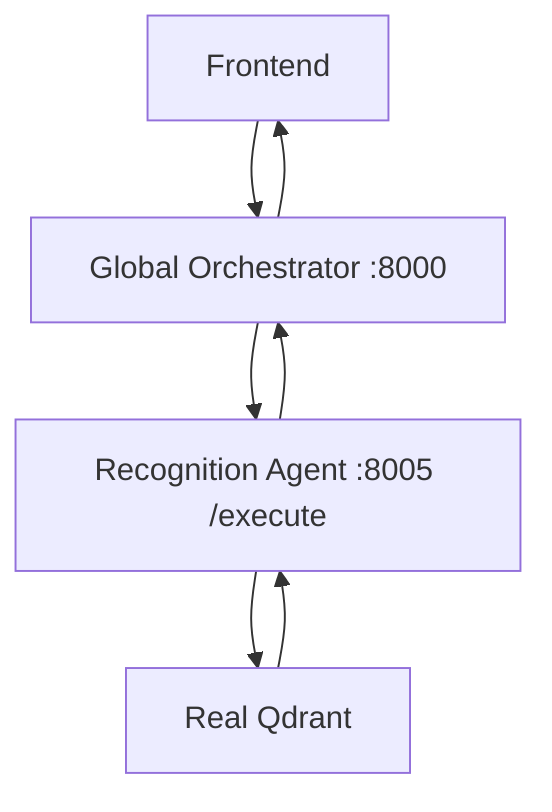
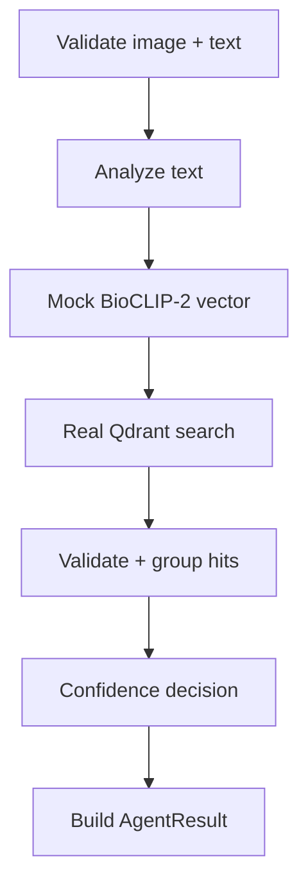

# Umbrella / Animal BioHub - Multimodal Recognition Agent

## Final Sprint 2 implementation specification for Claude Code

| Field | Value |
|---|---|
| Main implementation owner | Leith Saddouri |
| Qdrant ingestion owner | Chahd |
| Agent folder | `backend/agents/multimodal_recognition_agent/` |
| Agent port | `8005` |
| Parent service | Global Orchestrator |
| Shared endpoint | `POST /execute` |
| Version | 3.0 - final corrected scope |
| Date | 2026-08-05 |
| Status | Ready to use after Phase 0 contract confirmations |

> [!IMPORTANT]
> This document is the corrected Sprint 2 authority for the Multimodal Recognition Agent. Ignore older Recognition Agent plans that require either a fully mocked Qdrant path or a real BioCLIP-2 runtime during Sprint 2.

> [!IMPORTANT]
> **Final Sprint 2 boundary:** Qdrant is real and minimally functional. BioCLIP-2 is officially selected, but its execution is mocked during Sprint 2. GBIF, NCBI, and other external biological APIs are mocked. Only the team-approved reasoning LLM may be real.

> [!IMPORTANT]
> One request contains both a non-empty text instruction and one animal image. Image-only and text-only recognition requests are invalid.

---

## 0. Executive decision

Leith must replace the Recognition Agent's trivial response with a real, testable internal workflow while preserving the repository's shared HTTP contract.

The required Sprint 2 path is:

```text
Image + text
  -> Global Orchestrator
  -> POST http://localhost:8005/execute
  -> real input validation and workflow
  -> MockBioCLIP2Provider
  -> deterministic query vector
  -> real Qdrant collection
  -> real Top-K vector search and filtering
  -> real ranking and confidence rules
  -> optional approved reasoning LLM
  -> mocked GBIF/NCBI validation
  -> AgentResult
  -> Global Orchestrator
```

### 0.1 Component boundary

| Component | Sprint 2 mode | Mandatory? | Owner |
|---|---|---:|---|
| Recognition workflow | Real | Yes | Leith |
| `POST /execute` service | Real | Yes | Leith |
| Global Orchestrator integration | Real | Yes | Leith + orchestrator owner |
| BioCLIP-2 model execution | Mock | Yes, as a mock contract | Leith |
| BioCLIP-2 final model choice | Official and fixed | Yes | Team decision |
| Qdrant environment | Real, minimal | Yes | Chahd prepares; Leith consumes |
| Qdrant collection | Real, small Sprint 2 collection | Yes | Chahd |
| Vector insertion | Real | Yes | Chahd |
| Vector search and filtering | Real | Yes | Leith |
| GBIF/NCBI calls | Mock | Yes, as mock adapters | Leith |
| Reasoning LLM | Real if approved; deterministic fallback otherwise | Optional | Leith/team |
| Frontend changes | Out of Leith's scope | No | Frontend owner |
| Global Orchestrator code changes | Out of Leith's scope | No | Orchestrator owner |

### 0.2 Non-negotiable clarification

The Sprint 2 Qdrant environment must perform actual database operations:

- create or use a real collection;
- insert a small set of real Qdrant points;
- store payload metadata;
- run actual vector search;
- run actual payload filtering;
- return actual Qdrant hits to the Recognition Agent.

The vectors may be deterministic test vectors generated by the mock BioCLIP-2 provider. They are not scientific BioCLIP-2 embeddings and must never be described as such.

The Sprint 2 collection is a development/test collection. When real BioCLIP-2 is integrated later, the team must regenerate the reference embeddings and recreate or migrate the collection using the real model dimension and preprocessing contract.

---

## 1. Source-of-truth order

Claude Code must resolve implementation decisions in this order:

1. Current repository code and root `README.md`.
2. Explicit decisions confirmed by the project lead and shared-component owners.
3. This final Sprint 2 specification.
4. The Sprint 2 Qdrant contract agreed by Leith and Chahd.
5. `cahier de charge projet cis.pdf` for project-level objectives.
6. `Agent details.docx` for the long-term product vision.

The official documents describe a multimodal Species Recognition Agent and a centralized multi-agent platform. The current repository defines the runtime contract and commands. This specification defines the corrected Sprint 2 maturity boundary.

---

## 2. Instructions to Claude Code

Claude Code must:

1. Read the root `README.md` completely.
2. Read repository-local `AGENTS.md`, `CLAUDE.md`, `CONTRIBUTING.md`, and equivalent instructions.
3. Inspect the actual files in `backend/agents/multimodal_recognition_agent/` before proposing changes.
4. Inspect the current `api.py`, `schema.py`, `mock.py`, `card.json`, `description.md`, `requirements.txt`, and `.env.example`.
5. Use `backend/agents/trait_discovery_agent/` only as a read-only LangGraph reference.
6. Preserve `POST /execute`, `AgentRequest`, `AgentResult`, `AgentStatus`, and the existing API error conversion.
7. Make implementation changes only inside `backend/agents/multimodal_recognition_agent/**`.
8. Never import or call another agent directly.
9. Use `needs_agent` for cross-agent dependencies; let the Global Orchestrator choose and call the helper.
10. Implement a deterministic `MockBioCLIP2Provider`; do not install or execute real BioCLIP-2 in Sprint 2.
11. Implement a real Qdrant client and real retrieval path; do not replace Qdrant with fixtures or an in-memory fake in the Sprint 2 integration path.
12. Keep a `MockQdrantRetriever` only for isolated unit tests and offline failure tests. It must not be the Sprint 2 integration/demo path.
13. Keep GBIF and NCBI behind mock adapters; do not call their live APIs in Sprint 2.
14. Pin every new dependency in the agent's own `requirements.txt`.
15. Never commit `.env`, credentials, raw images, model weights, a populated Qdrant storage directory, `.venv`, caches, or logs containing image data.
16. Implement the phases in order and run each phase gate.
17. At the end, report changed files, commands run, tests passed, mock/real components, and unresolved blockers.

### 2.1 Forbidden Sprint 2 implementations

Claude Code must not:

- set `QDRANT_MODE=mock` as the final Sprint 2 configuration;
- use `MockQdrantRetriever` in the recorded integration demo;
- claim that Qdrant is deferred to a later sprint;
- install BioCLIP-2 weights or run real BioCLIP-2 inference;
- describe BioCLIP-2 as undecided or propose a different final model;
- generate fake Qdrant results without querying the real collection;
- call live GBIF, NCBI, IUCN, or other external biological APIs;
- add a new multipart recognition endpoint;
- modify shared orchestrator, registry, launcher, or frontend code without approval;
- make direct agent-to-agent HTTP calls;
- present deterministic test-vector similarity as scientific confidence.

### 2.2 Stop conditions

Stop implementation and request the relevant team decision if any of these remain unresolved:

- the shared-context image key or serialization format;
- the current shared schema cannot transport the image;
- port `8005` is not assigned to Recognition;
- the agent is absent from the registry or global launcher;
- Chahd has not confirmed the Sprint 2 collection name, vector name, dimension, distance, and payload schema;
- Leith cannot obtain read/query access to the Sprint 2 Qdrant collection;
- the query-vector mock contract differs from the vectors ingested by Chahd;
- a required change lies outside Leith's agent folder;
- a credential would have to be committed or hard-coded.

---

## 3. Repository contract - preserve exactly

### 3.1 Runtime topology



Every agent is an independent HTTP service. The frontend calls the Global Orchestrator. The Global Orchestrator selects and calls the Recognition Agent. The Recognition Agent does not call the frontend or another agent.

### 3.2 Shared input

The existing request contract is:

| Field | Type | Recognition meaning |
|---|---|---|
| `instruction` | `str` | Required non-empty user text |
| `context` | `dict` | Shared context containing the image and previous agent outputs |

Do not add top-level `image`, `request_id`, or other fields in Leith's branch.

### 3.3 Shared output

The agent must always return the repository's existing `AgentResult`:

| Field | Meaning |
|---|---|
| `status` | `completed`, `needs_agent`, `continue`, or `failed` |
| `output` | A dictionary on `completed`; merged into shared context |
| `target_agent` | Optional capability hint; the resolver may override it |
| `prompt_to_target_agent` | Plain-English dependency request |

Recognition status rules:

- `completed`: recognition workflow finished, including uncertain/no-match outcomes;
- `needs_agent`: recognition is sufficient but the user's requested biological follow-up requires another capability;
- `failed`: invalid input or an unrecoverable technical dependency failure;
- `continue`: do not use unless the current orchestrator owner confirms the behavior.

### 3.4 Image-plus-text mapping

Recommended mapping, subject to confirmation with the orchestrator owner:

```json
{
  "instruction": "Identify this animal and explain the result.",
  "context": {
    "recognition_image": {
      "data_url": "data:image/jpeg;base64,<BASE64>",
      "filename": "observation.jpg"
    }
  }
}
```

Rules:

- require a non-empty `instruction`;
- require exactly one image in the agreed context key;
- accept JPEG, PNG, or WEBP;
- reject invalid base64, corrupt files, oversized bytes, or unsafe pixel dimensions;
- never fetch arbitrary user-provided URLs;
- never log or persist raw image/base64 data;
- never replace `/execute` with multipart form data;
- never make the frontend call Recognition directly.

If the shared owner chooses another key or format, update only Recognition-owned documentation/tests and use the approved value. Do not change the shared schema unilaterally.

---

## 4. Sprint 2 recognition workflow

### 4.1 Real internal control flow



The control flow, state transitions, validation, Qdrant query, hit processing, ranking, confidence decision, error handling, and response construction are real.

### 4.2 Supported intents

Sprint 2 supports:

- species recognition from one image plus text;
- visual-similarity candidates from the same retrieval result;
- a clarification request for uncertain/no-match results;
- a scientific follow-up routed through `needs_agent` after sufficient identification.

Two-image comparison, video/audio recognition, image generation, and a complete biological profile assembled from all agents are outside Leith's Sprint 2 scope.

### 4.3 Evidence rules

1. The mock BioCLIP-2 provider generates the query vector but does not claim scientific inference.
2. Qdrant returns the actual nearest stored Sprint 2 test points.
3. Text may describe intent, location, habitat, or a suspected taxon.
4. Text must not create a species candidate that Qdrant did not retrieve.
5. A strong text-image conflict must downgrade the decision.
6. Qdrant similarity is not a probability.
7. Mock taxonomy data must be visibly labeled as mock/unverified.
8. No absent GBIF or NCBI identifier may be invented.

---

## 5. Internal domain contracts

Use repository-compatible Pydantic models or dataclasses. Adapt names to the existing code rather than duplicating equivalent models.

### 5.1 Normalized input

```python
class NormalizedRecognitionInput(BaseModel):
    instruction: str
    image_bytes: bytes
    media_type: Literal["image/jpeg", "image/png", "image/webp"]
    image_sha256: str
    context: dict[str, Any]
```

Do not place `image_bytes` or the base64 string in logs, outputs, checkpoints, or persisted state.

### 5.2 Text evidence

```python
class TextEvidence(BaseModel):
    intent: Literal["recognition", "similarity", "scientific_follow_up"]
    language: str | None = None
    location_hint: str | None = None
    habitat_hint: str | None = None
    taxon_hint: str | None = None
    requested_capability: str | None = None
```

### 5.3 Qdrant hit and species candidate

```python
class RetrievedReference(BaseModel):
    point_id: str
    species_id: str
    scientific_name: str
    common_name: str | None = None
    similarity_score: float
    source: str | None = None
    dataset_version: str
    embedding_mode: Literal["mock_bioclip2"]


class SpeciesCandidate(BaseModel):
    species_id: str
    scientific_name: str
    common_name: str | None = None
    similarity_score: float
    reference_count: int
    gbif_id: int | None = None
    ncbi_taxid: int | None = None
    taxonomy_status: Literal["mock_verified", "partial", "unverified"]
```

### 5.4 Recognition decision

```python
class RecognitionDecision(BaseModel):
    decision: Literal["identified", "uncertain", "not_identified"]
    primary_species: SpeciesCandidate | None
    candidates: list[SpeciesCandidate]
    text_alignment: Literal["agree", "neutral", "conflict"]
    explanation: str
    clarification_question: str | None = None
```

### 5.5 Completed output example

```json
{
  "status": "completed",
  "target_agent": null,
  "prompt_to_target_agent": null,
  "output": {
    "recognition": {
      "decision": "identified",
      "text_alignment": "neutral",
      "similarity_is_probability": false,
      "explanation": "The real Qdrant test retrieval supports the first Sprint 2 candidate. The embedding and taxonomy providers are mocked."
    },
    "species": "Panthera leo",
    "species_id": "panthera_leo",
    "gbif_id": null,
    "ncbi_taxid": null,
    "recognition_candidates": [],
    "recognition_provenance": {
      "embedding_provider": "MockBioCLIP2Provider",
      "embedding_mode": "mock",
      "retrieval_provider": "Qdrant",
      "retrieval_mode": "real_minimal",
      "collection": "<configured Sprint 2 collection>",
      "dataset_version": "<configured Sprint 2 version>",
      "taxonomy_mode": "mock"
    }
  }
}
```

Example species values are illustrative fixtures, not scientific output.

### 5.6 Delegation example

```json
{
  "status": "needs_agent",
  "target_agent": "Evolution",
  "prompt_to_target_agent": "For the species identified by Recognition, provide the evolutionary relationship requested by the user.",
  "output": null
}
```

The Capability Resolver may choose a different agent. Recognition must never import or HTTP-call the helper itself.

---

## 6. BioCLIP-2 mock contract

### 6.1 Official decision

BioCLIP-2 is the official model for the later real recognition phase. The provider abstraction is not permission to reopen model selection.

### 6.2 Sprint 2 implementation

```python
class BioCLIP2Provider(Protocol):
    def embed_image(self, image: NormalizedRecognitionInput) -> list[float]: ...


class MockBioCLIP2Provider:
    def embed_image(self, image: NormalizedRecognitionInput) -> list[float]:
        """Return a deterministic test vector matching the Sprint 2 collection dimension."""
```

Requirements:

- deterministic output for repeatable tests;
- vector length exactly equals the configured Sprint 2 Qdrant dimension;
- no BioCLIP-2 package import;
- no model-weight download;
- no GPU requirement;
- clear provenance value `embedding_mode = "mock"`;
- shared deterministic fixture/mapping contract with Chahd's ingestion.

For known demo images, a fixture mapping keyed by `image_sha256` may return agreed vectors. For unknown test images, use a deterministic seeded vector generator. Never claim that the generated vector represents biological similarity.

### 6.3 Mandatory later replacement

After Sprint 2, the team must:

1. pin the exact BioCLIP-2 model and revision;
2. pin the real preprocessing pipeline;
3. generate real reference embeddings;
4. create/migrate a Qdrant collection with the real vector dimension;
5. replace `MockBioCLIP2Provider` with `RealBioCLIP2Provider`;
6. calibrate thresholds using real evaluation data.

This later work is mandatory for the final system but not part of Sprint 2 Definition of Done.

---

## 7. Real minimal Qdrant contract

### 7.1 Qdrant is mandatory now

Sprint 2 must include:

- a configured reachable Qdrant environment;
- a real Sprint 2 collection;
- collection metadata/vector configuration;
- a small number of inserted test points;
- real vector search;
- real payload filtering;
- retrieval tests inside the Recognition workflow.

### 7.2 Responsibility split

Chahd owns:

- selecting/provisioning the Sprint 2 Qdrant environment with the team;
- creating the small Sprint 2 collection;
- defining vector name, dimension, distance, and payload schema;
- implementing/running the Sprint 2 test ingestion;
- inserting deterministic test vectors and payloads;
- providing the manifest, dataset version, sample payloads, and known-answer cases;
- correcting ingestion-side contract violations.

Leith owns:

- implementing the Recognition Agent's Qdrant adapter;
- reading Qdrant configuration from environment variables;
- validating the collection contract before querying;
- generating a deterministic query vector through `MockBioCLIP2Provider`;
- sending the real query to Qdrant;
- applying real payload filters when required;
- validating returned payloads;
- grouping/ranking hits by species;
- handling timeout, unavailable, no-hit, and invalid-payload cases;
- testing retrieval inside the full agent workflow.

Leith does not create Chahd's ingestion pipeline. Chahd does not implement Leith's agent workflow. They must agree on one shared manifest.

### 7.3 Contract to freeze with Chahd

Do not hard-code unconfirmed values.

| Property | Required value |
|---|---|
| Qdrant URL | Exact Sprint 2 endpoint |
| Access | Query/read credentials for Leith; write access for Chahd |
| Collection name | Exact Sprint 2 collection |
| Vector name | Exact named-vector key or explicit unnamed-vector decision |
| Vector dimension | Exact deterministic mock-vector length |
| Distance | Exact collection distance, normally `Cosine` if agreed |
| Embedding mode | `mock_bioclip2` |
| Mock provider version | Shared immutable version string |
| Dataset version | Shared Sprint 2 version |
| Payload schema | Required keys and types |
| Filter fields | Fields that must be indexed/filterable |
| Top-K | Initial retrieval size |

Suggested manifest:

```json
{
  "collection_name": "<team-confirmed-name>",
  "vector_name": "<team-confirmed-name-or-null>",
  "vector_dimension": 32,
  "distance": "Cosine",
  "embedding_mode": "mock_bioclip2",
  "mock_provider_version": "sprint2-mock-bioclip2-v1",
  "dataset_version": "sprint2-qdrant-minimal-v1",
  "required_payload_fields": [
    "species_id",
    "scientific_name",
    "dataset_version",
    "embedding_mode"
  ]
}
```

The dimension `32` is only an example. Claude Code must use Chahd's confirmed manifest.

### 7.4 Minimum point payload

```json
{
  "reference_id": "sprint2-ref-001",
  "species_id": "panthera_leo",
  "scientific_name": "Panthera leo",
  "common_name": "lion",
  "source": "Sprint 2 controlled fixture",
  "dataset_version": "sprint2-qdrant-minimal-v1",
  "embedding_mode": "mock_bioclip2",
  "mock_provider_version": "sprint2-mock-bioclip2-v1"
}
```

Optional mock GBIF/NCBI IDs may be stored only if clearly labeled as fixture data. They must not be presented as live validation.

### 7.5 Retrieval policy

Initial configurable policy:

1. validate query vector length;
2. query the real collection without returning stored vectors;
3. request payloads;
4. apply agreed payload filters such as dataset/embedding version;
5. retrieve a configurable Top-K reference set;
6. reject hits missing mandatory payload fields;
7. group hits by `species_id`;
8. aggregate up to the best three references per species;
9. sort distinct species by aggregated similarity;
10. retain up to five candidates;
11. compute the top-one/top-two margin;
12. pass structured evidence to the confidence gate.

Thresholds are configurable scenario boundaries for Sprint 2, not scientific calibration.

### 7.6 Allowed Qdrant mock

`MockQdrantRetriever` is allowed only for:

- unit tests of ranking and error branches;
- offline development before Chahd grants access;
- a backup demo if the shared environment is temporarily unavailable.

It does not satisfy the Sprint 2 Qdrant deliverable. The recorded integration test and normal Sprint 2 demo must use the real Qdrant environment.

---

## 8. Taxonomy and reasoning LLM

### 8.1 Taxonomy

Use `MockTaxonomyProvider` during Sprint 2. It must cover:

- verified fixture;
- partial fixture;
- missing match;
- simulated timeout/unavailable response.

Do not call live GBIF or NCBI. Do not invent identifiers when the mock contract has none.

### 8.2 Reasoning LLM

If the team provides the approved shared deployment, the Recognition Agent may use it for:

- intent classification into a fixed enum;
- extraction of location/habitat/taxon hints;
- a short explanation grounded only in structured evidence.

The LLM must not:

- perform visual recognition;
- generate the Qdrant vector;
- create unretrieved species candidates;
- calculate similarity;
- invent taxonomy identifiers;
- choose/call another agent;
- receive raw image bytes or base64.

Use deterministic rules by default. Tests must run without LLM credentials.

---

## 9. Suggested folder design

Adapt this structure to the current folder; do not recreate equivalent files unnecessarily.

```text
backend/agents/multimodal_recognition_agent/
├── api.py
├── schema.py
├── mock.py
├── card.json
├── description.md
├── requirements.txt
├── .env.example
├── config.py
├── domain/
│   ├── models.py
│   ├── ranking.py
│   ├── confidence.py
│   └── errors.py
├── adapters/
│   ├── bioclip.py          # protocol + MockBioCLIP2Provider
│   ├── qdrant.py           # RealQdrantRetriever + unit-test mock
│   ├── taxonomy.py         # MockTaxonomyProvider
│   └── reasoning_llm.py    # optional approved LLM + rules fallback
├── workflows/
│   ├── state.py
│   ├── nodes.py
│   └── graph.py
├── fixtures/
│   ├── mock_embeddings.json
│   └── mock_taxonomy.json
├── tests/
│   ├── test_contract.py
│   ├── test_validation.py
│   ├── test_mock_bioclip2.py
│   ├── test_qdrant_adapter.py
│   ├── test_ranking.py
│   ├── test_confidence.py
│   ├── test_workflow.py
│   └── test_api.py
└── docs/
    ├── architecture.md
    ├── qdrant-contract.md
    ├── evaluation-report.md
    └── demo-runbook.md
```

---

## 10. Configuration

Add placeholders only to the agent's `.env.example`:

```env
RECOGNITION_IMAGE_CONTEXT_KEY=recognition_image
MAX_IMAGE_BYTES=10485760
MAX_IMAGE_PIXELS=25000000
MIN_IMAGE_WIDTH=64
MIN_IMAGE_HEIGHT=64

BIOCLIP_PROVIDER_MODE=mock
BIOCLIP_MOCK_PROVIDER_VERSION=sprint2-mock-bioclip2-v1
MOCK_EMBEDDING_DIMENSION=

QDRANT_MODE=real
QDRANT_URL=
QDRANT_API_KEY=
QDRANT_COLLECTION=
QDRANT_VECTOR_NAME=
QDRANT_EXPECTED_DIMENSION=
QDRANT_EXPECTED_DISTANCE=Cosine
QDRANT_DATASET_VERSION=
QDRANT_TOP_K_REFERENCES=30
RECOGNITION_TOP_K_SPECIES=5
QDRANT_TIMEOUT_SECONDS=10

IDENTIFIED_MIN_SCORE=
IDENTIFIED_MIN_MARGIN=
UNCERTAIN_MIN_SCORE=

TAXONOMY_PROVIDER_MODE=mock
TEXT_ANALYZER_MODE=rules
AZURE_OPENAI_BASE_URL=
AZURE_OPENAI_API_KEY=
AZURE_OPENAI_DEPLOYMENT=
AZURE_OPENAI_REASONING_EFFORT=low
AZURE_OPENAI_MAX_OUTPUT_TOKENS=400
RECOGNITION_LLM_MAX_CALLS_PER_REQUEST=1
```

Mandatory validation:

- `BIOCLIP_PROVIDER_MODE` must equal `mock` in Sprint 2;
- `QDRANT_MODE` must equal `real` for integration/demo mode;
- `TAXONOMY_PROVIDER_MODE` must equal `mock`;
- mock embedding dimension must equal Qdrant expected dimension;
- collection dimension/distance/vector name must match the manifest;
- inconsistent thresholds or invalid limits must fail clearly;
- tests may override Qdrant with a mock, but integration configuration may not.

---

## 11. Implementation phases

### Phase -1 - Repository access and baseline

Tasks:

- clone the existing repository and create Leith's feature branch;
- create the agent-specific virtual environment;
- install existing dependencies;
- run the current mock and tests;
- verify `.env` is ignored;
- record a clean baseline.

Gate:

- current agent answers at `http://localhost:8005/execute`;
- baseline tests are recorded;
- `git status` is clean.

### Phase 0 - Contract freeze

Leith must confirm:

- actual `AgentRequest` and `AgentResult` schemas;
- port `8005` and existing registry/launcher entries;
- shared image context key and serialization;
- Recognition output keys;
- optional helper-agent resume keys;
- Qdrant manifest with Chahd;
- whether the approved reasoning LLM is enabled.

Deliverables inside Leith's folder:

- `docs/architecture.md`;
- `docs/qdrant-contract.md`;
- updated `card.json` draft;
- short decision log.

Gate:

- image transport is approved;
- Qdrant contract is approved;
- no unauthorized shared-file change is required.

### Phase 1 - Mock BioCLIP-2 vertical slice

Tasks:

- preserve `run(request) -> AgentResult`;
- validate image plus text;
- decode images safely;
- create normalized domain models;
- implement `MockBioCLIP2Provider`;
- implement mock taxonomy and deterministic confidence branches;
- return output keys declared in `card.json`;
- add controlled invalid-input results.

Gate:

- valid paired request returns a structured result with mock provenance;
- missing image/text fails safely;
- no unhandled 500 occurs;
- no real BioCLIP-2 runtime is installed or executed.

### Phase 2 - Real minimal Qdrant

Chahd tasks:

- configure the Qdrant environment;
- create the Sprint 2 collection;
- define/index payload metadata;
- generate deterministic fixture vectors using the shared mock contract;
- insert a small dataset;
- provide Leith with read/query access and the manifest.

Leith tasks:

- implement `RealQdrantRetriever`;
- validate collection configuration;
- submit query vectors from `MockBioCLIP2Provider`;
- run real Top-K search and payload filters;
- validate payloads and aggregate hits by species;
- handle unavailable, timeout, no-hit, and malformed-hit cases.

Joint gate:

- points exist in the real collection;
- a real Qdrant query returns expected fixture hits;
- filtering is demonstrated;
- Leith's query contract matches Chahd's ingestion contract;
- results declare `embedding_mode=mock` and `retrieval_mode=real_minimal`.

### Phase 3 - Text, fusion, and confidence

Tasks:

- implement deterministic intent rules;
- extract optional context hints;
- add the optional approved LLM behind an adapter;
- implement agree/neutral/conflict logic;
- implement configurable `identified`, `uncertain`, and `not_identified` decisions;
- implement mock taxonomy branches;
- create grounded explanations.

Gate:

- text cannot introduce an unretrieved species;
- strong conflict cannot return `identified`;
- LLM/taxonomy failure degrades safely;
- clear intents need no LLM call.

### Phase 4 - Internal LangGraph workflow

Tasks:

- define internal Recognition state;
- add validation, preprocessing, text, mock embedding, real retrieval, aggregation, taxonomy, fusion, confidence, delegation, response, and failure nodes;
- keep nodes independently testable;
- route all terminals through one `AgentResult` builder;
- do not add persistent memory/checkpointing.

Gate:

- all graph paths return the shared contract;
- every node is testable;
- no node calls another agent;
- the integration path uses real Qdrant.

### Phase 5 - Evaluation

Tasks:

- run at least ten paired deterministic Sprint 2 scenarios;
- include clear, close-candidate, no-hit, conflict, invalid, filter, timeout, and malformed-payload cases;
- record expected/actual candidate, scores, margin, decision, latency, and errors;
- label thresholds as workflow test boundaries, not scientific accuracy.

Gate:

- at least ten scenarios are recorded;
- real Qdrant is used for normal retrieval cases;
- uncertain cases do not become fabricated confident results.

### Phase 6 - Service and launcher integration

Tasks:

- start Recognition alone on port `8005`;
- exercise response branches through `POST /execute`;
- run `python -m backend.run_agents`;
- confirm the agent's own virtual environment is used;
- confirm the other eight agents still start.

Gate:

- standalone request succeeds;
- all nine agent services start;
- no unauthorized file changed.

### Phase 7 - Global Orchestrator integration

With the orchestrator owner:

- start all agents;
- start the Global Orchestrator;
- send a paired image-and-text request;
- verify Planner routing from `card.json`;
- verify the HTTP call to `:8005/execute`;
- verify output merges into shared context;
- optionally test one `needs_agent` route;
- record a frontend image-transport gap as a shared-owner issue if necessary.

Gate:

- Global Orchestrator reaches Recognition over HTTP;
- the returned envelope is consumed without schema error;
- no direct peer communication occurs.

### Phase 8 - Documentation and handoff

Tasks:

- run unit, contract, Qdrant integration, workflow, service, launcher, and orchestrator tests;
- update Recognition-owned `description.md` and setup instructions;
- document configuration without secrets;
- prepare a five-minute demo and an offline fallback;
- stage only Leith's folder.

Gate:

- Definition of Done is checked;
- another teammate can reproduce the demo;
- no secret, model weight, raw image, local database, or environment is committed.

---

## 12. Commands from the repository README

Run from the repository root on Windows PowerShell unless stated otherwise.

### Create and activate the Recognition environment

```powershell
python -m venv backend\agents\multimodal_recognition_agent\.venv
backend\agents\multimodal_recognition_agent\.venv\Scripts\Activate.ps1
pip install -r backend\agents\multimodal_recognition_agent\requirements.txt
(Get-Command python).Source
```

### Run Recognition alone

```powershell
python -m uvicorn backend.agents.multimodal_recognition_agent.api:app --port 8005 --reload
```

Interactive docs: `http://localhost:8005/docs`

### Run Recognition tests

```powershell
python -m pytest backend\agents\multimodal_recognition_agent\tests -v
```

### One-time setup for all agents

```powershell
python -m backend.run_agents --setup
```

### Start all nine agents

```powershell
python -m backend.run_agents
```

### Start the Global Orchestrator console test

```powershell
python -m backend.test_orchestrator
```

### Start the Global Orchestrator API

```powershell
python -m uvicorn backend.api:app --reload --port 8000
```

### Start the frontend

```powershell
cd frontend
npm install
npm run dev
```

### Full three-terminal run

```powershell
# Terminal 1 - all nine agents
python -m backend.run_agents

# Terminal 2 - orchestrator API
python -m uvicorn backend.api:app --reload --port 8000

# Terminal 3 - frontend
cd frontend
npm run dev
```

Do not run `python backend\api.py` and do not change into `backend` before module commands.

Qdrant startup/provisioning commands are not invented here because the team environment is not specified in the supplied README. Chahd must document the approved local/cloud environment and provide connection values through ignored environment files.

---

## 13. Test matrix

| ID | Scenario | Expected result |
|---|---|---|
| T-001 | Valid image + non-empty instruction | `completed` Recognition envelope |
| T-002 | Missing image | Controlled `failed` |
| T-003 | Empty text | Controlled `failed` |
| T-004 | Invalid data URL/base64 | Controlled `failed` |
| T-005 | Unsupported media type | Controlled `failed` |
| T-006 | Corrupt image | Controlled `failed` |
| T-007 | Oversized image/pixel area | Controlled `failed` |
| T-008 | Mock BioCLIP-2 deterministic repeat | Same vector for same fixture/version |
| T-009 | Mock vector dimension mismatch | Controlled failure before query |
| T-010 | Real Qdrant connection | Collection reachable |
| T-011 | Real Qdrant Top-K | Actual stored points returned |
| T-012 | Qdrant payload filter | Only matching dataset/provider version returned |
| T-013 | No Qdrant hits | `completed` + `not_identified` |
| T-014 | Duplicate references for one species | One aggregated species candidate |
| T-015 | Missing required payload field | Hit rejected or warning recorded |
| T-016 | Qdrant unavailable/timeout | Controlled `failed` or documented fallback |
| T-017 | Clear top candidate | `identified` test decision |
| T-018 | Close candidates | `uncertain` |
| T-019 | Text agrees with candidate | `text_alignment=agree`; raw score unchanged |
| T-020 | Text conflicts with candidates | `text_alignment=conflict`; no `identified` |
| T-021 | Generic identification text | `text_alignment=neutral` |
| T-022 | Mock taxonomy unavailable | Visible unverified state; no invented ID |
| T-023 | Scientific follow-up after identification | `needs_agent` |
| T-024 | Scientific follow-up after uncertain result | No delegation; clarification returned |
| T-025 | Resumed request contains helper output | `completed` with agreed context key |
| T-026 | Clear intent with rules | Zero Recognition LLM calls |
| T-027 | Approved LLM unavailable | Rules fallback; no crash |
| T-028 | Malicious instruction | No tool/peer execution; fixed enums only |
| T-029 | Standalone `/execute` | Shared response schema |
| T-030 | `backend.run_agents` | Recognition starts on port 8005 |
| T-031 | Global Orchestrator round trip | Output merges into shared context |
| T-032 | Direct-peer dependency scan | No peer import, URL, or HTTP configuration |
| T-033 | Logs | No image/base64, vector, secret, or sensitive text |
| T-034 | Provenance | `BioCLIP=mock`, `Qdrant=real_minimal`, taxonomy=`mock` |
| T-035 | Real BioCLIP guard | Sprint 2 cannot enable/download real model |
| T-036 | Qdrant mock guard | Integration/demo fails if configured with mocked retrieval |

### Test layers

- Unit: validation, mock embedding, ranking, confidence, response building.
- Contract: shared request/result, card/output keys, Qdrant manifest/payload.
- Adapter: mocked BioCLIP/taxonomy/LLM failures; real Qdrant adapter behavior.
- Integration: `MockBioCLIP2Provider` + real Sprint 2 Qdrant collection.
- Workflow: full internal graph with real Qdrant retrieval.
- Service: HTTP `POST /execute` on port `8005`.
- System: all-agent launcher and Global Orchestrator HTTP call.

---

## 14. Sprint 2 Definition of Done

### Contract and modality

- [ ] `POST /execute`, `AgentRequest`, and `AgentResult` are preserved.
- [ ] Both image and non-empty text are mandatory.
- [ ] The approved image context key/format is documented and tested.
- [ ] Invalid image/text inputs fail safely without HTTP 500.
- [ ] `card.json` matches actual capabilities and output keys.

### BioCLIP-2 boundary

- [ ] BioCLIP-2 remains the documented official final model.
- [ ] Sprint 2 uses `MockBioCLIP2Provider` only.
- [ ] No real BioCLIP-2 weight/package/runtime is required or executed.
- [ ] Mock vectors are deterministic and clearly labeled non-scientific.
- [ ] The later real-provider replacement point is documented.

### Real minimal Qdrant

- [ ] A real Qdrant environment is configured and reachable.
- [ ] Chahd created and populated a small Sprint 2 collection.
- [ ] The manifest freezes vector name, dimension, distance, provider version, dataset version, and payload fields.
- [ ] Leith's agent connects to the real collection.
- [ ] Leith runs real Top-K search and real filtering.
- [ ] Returned hits are validated, grouped, and ranked.
- [ ] No-hit, timeout, unavailable, malformed-payload, and mismatch paths are controlled.
- [ ] The normal integration/demo path does not use `MockQdrantRetriever`.
- [ ] Provenance says `embedding=mock` and `retrieval=real_minimal`.

### Reasoning and taxonomy

- [ ] Text cannot create an unretrieved candidate.
- [ ] Confidence returns `identified`, `uncertain`, or `not_identified`.
- [ ] GBIF/NCBI remain mocked and clearly labeled.
- [ ] The optional approved LLM is bounded, grounded, and replaceable.
- [ ] Tests run without LLM credentials.

### Orchestration

- [ ] Recognition never imports or directly calls another agent.
- [ ] Cross-agent dependencies use `needs_agent`.
- [ ] Completed output is a dictionary and merges into shared context.
- [ ] Recognition runs alone on port `8005`.
- [ ] Recognition starts through `python -m backend.run_agents`.
- [ ] All nine services start together.
- [ ] Global Orchestrator reaches Recognition over HTTP.
- [ ] No unauthorized shared file is modified.

### Quality and delivery

- [ ] Unit, contract, Qdrant integration, workflow, service, and system tests pass.
- [ ] At least ten paired Sprint 2 scenarios are recorded.
- [ ] Thresholds are labeled test boundaries, not scientific calibration.
- [ ] Exact run/test commands are documented.
- [ ] Demo runbook and offline fallback are ready.
- [ ] No secret, `.env`, `.venv`, model weight, raw image, local Qdrant storage, or cache is committed.
- [ ] Leith's retrieval work and Chahd's ingestion work are clearly separated.

---

## 15. Explicitly out of Leith's Sprint 2 scope

- modifying the Global Orchestrator internals;
- modifying `backend/registry.py`, `backend/api.py`, or `backend/run_agents.py` without approval;
- modifying the frontend/upload UI;
- direct agent-to-agent calls;
- implementing Chahd's ingestion pipeline;
- provisioning/deleting shared Qdrant infrastructure without team approval;
- real BioCLIP-2 installation or inference;
- model training or fine-tuning;
- live GBIF/NCBI/IUCN calls;
- production deployment, autoscaling, CI/CD, or dashboards;
- GraphRAG and long-term/Zep memory;
- two-image, audio, or video recognition;
- animal image generation;
- final scientific-accuracy claims.

Leith still owns the Qdrant query integration inside Recognition. “Ingestion is out of scope” does not mean “Qdrant is out of scope.”

---

## 16. Demo runbook

### Demo A - Qdrant evidence

1. Show the real Qdrant environment and Sprint 2 collection.
2. Show that Chahd's small test points and payloads exist.
3. Run one direct controlled retrieval or integration test.
4. Show real Top-K hits and a real payload filter.
5. State that the vectors were generated by the deterministic BioCLIP-2 mock.

### Demo B - Recognition standalone

1. Start Recognition on port `8005`.
2. Submit an `AgentRequest` with image plus text.
3. Show `MockBioCLIP2Provider` provenance.
4. Show real Qdrant candidates and the controlled decision.
5. Show that similarity is not labeled probability.

### Demo C - Safe branches

1. Send a request without image or text and show controlled `failed`.
2. Send a close/no-hit fixture and show `uncertain` or `not_identified`.
3. Simulate taxonomy/LLM failure and show safe fallback.

### Demo D - Repository and orchestrator

1. Run `python -m backend.run_agents`.
2. Show Recognition starts at `8005` with the other eight agents.
3. Start the Global Orchestrator.
4. Show Planner routing and the HTTP call to `:8005/execute`.
5. Show output merged into shared context.
6. Optionally show `needs_agent` and confirm the resolver performs peer selection.

If Qdrant is temporarily unavailable during a live presentation, use the offline mock only as a backup and show previously recorded real-Qdrant test evidence. The backup does not replace the Sprint 2 Qdrant deliverable.

---

## 17. Pull request strategy

Recommended branch:

```text
feature/multimodal-recognition-agent/sprint2-workflow-qdrant
```

Recommended commits:

1. `docs(recognition): freeze image and qdrant contracts`
2. `test(recognition): add shared contract and validation coverage`
3. `feat(recognition): add mock bioclip2 provider`
4. `feat(recognition): add real qdrant retrieval adapter`
5. `feat(recognition): add ranking taxonomy mocks and confidence`
6. `feat(recognition): compose internal langgraph workflow`
7. `test(recognition): add real qdrant and orchestrator integration`
8. `docs(recognition): add setup evaluation and demo runbook`

Before committing:

```powershell
git status
git add backend/agents/multimodal_recognition_agent
git status
```

Do not stage a file outside Leith's agent folder. Ask the relevant owner if a shared change is needed.

---

## 18. Required Claude Code final report

Claude Code must finish with:

- files changed;
- commands run;
- tests passed/failed/skipped;
- confirmed image transport contract;
- confirmed Qdrant manifest values;
- proof that normal integration used real Qdrant;
- proof that BioCLIP-2 and taxonomy remained mocked;
- LLM mode used;
- standalone, launcher, and Global Orchestrator integration results;
- unresolved blockers and owner of each blocker;
- confirmation that no file outside Leith's folder was modified.

Do not claim completion if the real Qdrant environment or collection was not available. Report that as a Sprint 2 blocker rather than silently switching the final integration to a mock.

---

## 19. Final implementation boundary

> Leith implements the real internal workflow of `backend/agents/multimodal_recognition_agent/`, preserving `POST /execute`, `AgentRequest`, and `AgentResult`. The Sprint 2 query embedding is produced by a deterministic mock of the officially selected BioCLIP-2 model. Chahd creates and minimally populates a real Qdrant collection using the same mock-vector contract. Leith connects the agent to that real collection, executes real Top-K retrieval and filtering, validates and ranks the returned hits, and integrates the result with the Global Orchestrator. GBIF/NCBI remain mocked, and only the approved reasoning LLM may be real. Real BioCLIP-2 inference is mandatory later, but it is not part of Sprint 2.
