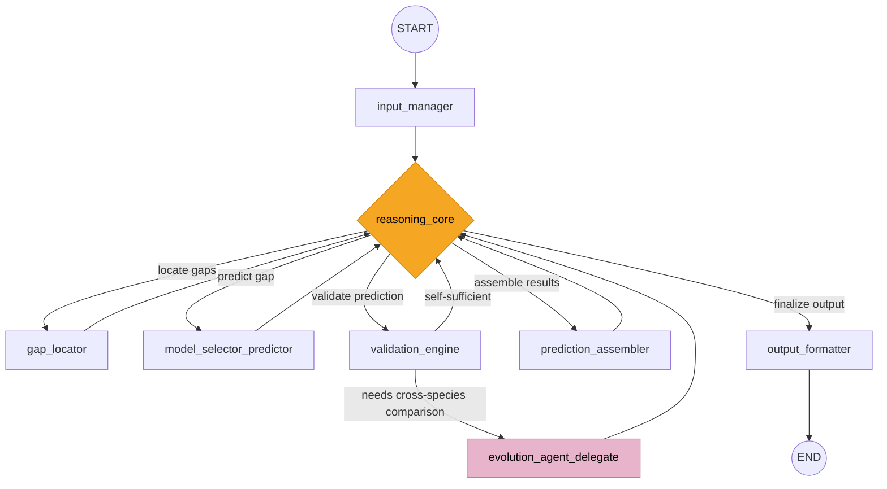

# 1. Datasets

**Note de cadrage**

Le Reconstruction Agent ne reconstruit jamais un chromosome entier. L'unité de travail est un segment de 10 à 500 paires de bases, avec un contexte de ~1 000 pb de part et d'autre. Les assemblages "chromosome-level" mentionnés ci-dessous ne sont utilisés que comme source propre pour générer ces petites fenêtres d'entraînement par masquage artificiel — pas comme unité de reconstruction.

**Choix des espèces d'entraînement** : les éléphants d'Afrique et d'Asie sont les espèces phylogénétiquement proches du mammouth (Proboscidea) et constituent le cœur du signal d'entraînement pour la validation. Les espèces Carnivora (tigre, chien, chat, loup, ours polaire, ours brun) sont incluses pour la diversité inter-mammifères lors du pré-entraînement — elles améliorent la capacité de généralisation du modèle sur les motifs génomiques conservés, mais ne servent pas de référence phylogénétique directe pour la cible de validation mammouth.

## A. Source principale — NCBI (suffisante à elle seule)

| Ressource | Usage |
|---|---|
| NCBI Assembly | Génomes complets des espèces d'entraînement |
| NCBI Nuccore | Séquences ADN brutes, y compris mitochondriales |

## B. Complément — ENA (European Nucleotide Archive)

Uniquement pour le mammouth : les génomes les plus récents et les plus complets (22-23 individus, dont un de 700 000 ans) sont déposés en premier lieu sur l'ENA, sous le projet PRJEB59491, pas systématiquement sur NCBI.

## C. Optionnel (post-Sprint 1) — RepeatMasker

Annotations de régions répétitives (télomères, satellites), via NCBI ou UCSC. Amélioration de qualité, pas un blocant pour le MVP.

## D. Espèces d'entraînement

| Espèce | Nom scientifique | Accession NCBI |
|---|---|---|
| Éléphant d'Afrique | Loxodonta africana | GCF_000001905.1 / GCA_033060095.1 |
| Éléphant d'Asie | Elephas maximus | GCA_033060105.1 |
| Tigre | Panthera tigris | GCA_018350195.2 |
| Chien | Canis lupus familiaris | GCF_011100685.1 |
| Chat | Felis catus | GCF_018350175.1 |
| Loup, ours polaire, ours brun | — | `datasets summary genome taxon "<espèce>" --assembly-level chromosome` |

## E. Espèce d'inférence/validation (jamais dans train/val/test)

| Ressource | Détail |
|---|---|
| Génomes mammouth (22-23 individus) | ENA, projet PRJEB59491 |
| Premier génome nucléaire quasi-complet (2008) | NCBI trace archive, SRA001810 |
| Génome mitochondrial complet annoté | 16 851 pb |

## F. Volumétrie et splits

- ~2,5-3,5 milliards de pb par génome → 1-3 millions de fenêtres de 2 010 à 2 500 pb par génome
- Split 80/10/10 (train/val/test), strict par espèce, par chromosome, et par `sequence_type` (nucléaire / mitochondrial)
- Licence : accès public NCBI/ENA, citation obligatoire

---

# 2. Flow diagram — LangGraph StateGraph

Le Reconstruction Agent est modélisé comme un **LangGraph `StateGraph`** dont la topologie est la suivante :

- **`input_manager`** est le nœud d'entrée (`START → input_manager`). Il valide l'input et transmet le contrôle au nœud central.
- **`reasoning_core`** est le **seul nœud décisionnel** du graphe. C'est un hub central vers lequel tous les nœuds-outils renvoient leur résultat. À chaque passage, il inspecte l'état courant du graphe et route vers le prochain nœud-outil approprié via une **arête conditionnelle**. L'ordre d'appel émerge du raisonnement du Core sur l'état — il n'est pas codé en dur.
- **`gap_locator`**, **`model_selector_predictor`**, **`validation_engine`**, **`prediction_assembler`** sont des nœuds-outils accessibles uniquement depuis `reasoning_core`. Chacun exécute sa tâche et renvoie son résultat à `reasoning_core`. Aucun outil n'appelle directement un autre outil.
- **`evolution_agent_delegate`** est un nœud spécial accessible via une **arête conditionnelle depuis `validation_engine`** (pas depuis `reasoning_core`). Quand le Validation Engine détermine qu'une comparaison inter-espèces nécessite l'Evolution Agent, le graphe route vers ce nœud de délégation. Son résultat est renvoyé à `reasoning_core`.
- **`output_formatter`** est le nœud terminal (`output_formatter → END`). Il est invoqué quand `reasoning_core` détermine que le traitement est complet (ou qu'il faut s'arrêter sur erreur / résultat partiel).
- **Les cycles sont normaux et attendus.** Par exemple, `reasoning_core` peut invoquer `model_selector_predictor` plusieurs fois pour le même gap en peuplant `previous_attempts` après chaque échec, ou ré-invoquer `validation_engine` après un ajustement de prédiction.



**Lecture du diagramme** :
- Les arêtes depuis `reasoning_core` sont conditionnelles : le Core choisit le prochain nœud en fonction de l'état.
- L'arête `validation_engine → evolution_agent_delegate` est conditionnelle : elle n'est empruntée que si le Validation Engine signale un besoin de comparaison inter-espèces (via un flag dans l'état du graphe).
- Les retours vers `reasoning_core` (arêtes montantes) permettent les cycles.

---

# 3. Pipeline d'ingestion de données

1. **Collecte**
   → NCBI Datasets API : télécharger les assemblages FASTA (espèces vivantes de la liste)
   → Filtrer sur `assembly_level ∈ {Chromosome, Complete Genome}`

2. **Nettoyage / QC**
   → Rejeter les scaffolds trop courts ou avec un taux de N déjà trop élevé
   → Normaliser les headers FASTA (espèce, chromosome, accession)
   → Annoter chaque contig/chromosome avec `sequence_type: "nuclear" | "mitochondrial"` selon son origine (génome nucléaire vs. génome mitochondrial)

3. **Fenêtrage (chunking)**
   → Découper chaque chromosome en fenêtres de taille variable :
     taille = contexte_gauche (1 000 pb) + région_cible + contexte_droit (1 000 pb),
     soit de 2 010 pb (gap minimal de 10 pb) à 2 500 pb (gap maximal de 500 pb).
   → La taille de fenêtre s'adapte à la longueur du segment masqué (entraînement)
     ou du gap réel (inférence), plafonnée à 2 500 pb.
   → Chaque fenêtre hérite du `sequence_type` de son contig source.

4. **Masquage auto-supervisé**
   → Masquer aléatoirement des segments de 10 à 500 pb à l'intérieur de chaque fenêtre
   → Générer les triplets (contexte_gauche, N…N, contexte_droit) → target

5. **Tokenisation**
   → Encodage k-mer ou nucléotide-par-nucléotide, selon le tokenizer du modèle
     sélectionné par le Sélecteur de modèle & Prédicteur (DNABERT, Nucleotide Transformer, Seq2Seq)

6. **Split train/val/test**
   → Split par espèce, par chromosome, et par `sequence_type` pour éviter la fuite de données
   → Réserver le mammouth uniquement pour l'inférence finale (jamais dans train/val/test)
   → **Métriques** : les performances doivent être rapportées séparément par `sequence_type` (nucléaire vs. mitochondrial) et non moyennées ensemble — les caractéristiques de ces deux types de séquences (taille, taux de mutation, couverture GC) diffèrent substantiellement.

7. **Stockage**
   → Fichiers FASTA bruts : stockage objet (S3-like), pas en base de données
   → Métadonnées (accession, positions des gaps, espèce, `sequence_type`) : PostgreSQL
   → Embeddings DNABERT / Nucleotide Transformer / features dérivées : Qdrant/ChromaDB

---

# 4. Plan de l'orchestrateur

## Architecture — LangGraph StateGraph

Le Reconstruction Agent est implémenté comme un **LangGraph `StateGraph`**. Le nœud `reasoning_core` est le **seul nœud décisionnel** : il inspecte l'état courant du graphe (gaps trouvés, prédictions en cours, validations effectuées, erreurs rencontrées) et route vers le prochain nœud-outil via une arête conditionnelle. L'ordre d'exécution des outils **émerge du raisonnement du Core sur l'état** — il n'est pas dicté par une séquence câblée en dur.

Les 6 outils spécialisés sont des nœuds du graphe, appelés de façon conditionnelle par gap et par requête. Un 7e nœud, `evolution_agent_delegate`, gère la délégation externe vers l'Evolution Agent.

| Outil | Rôle | Comportement de routage typique |
|---|---|---|
| Input Manager | Valide le format FASTA, nettoie la séquence, vérifie l'espèce, détermine si elle est éteinte (fait autorité sur `species_metadata["is_extinct"]`), détermine le `sequence_type` | Nœud d'entrée du graphe — toujours le premier traversé. Si la validation échoue, le Core route directement vers Output Formatter avec un résultat d'erreur |
| Gap Locator | Localise et caractérise les régions N, écarte les gaps hors périmètre (chromosome-scale) | Invoqué quand le Core a un génome validé mais pas encore de carte des gaps |
| Sélecteur de modèle & Prédicteur | Choisit le modèle par gap (taille, espèce, échec précédent) et génère la prédiction | Invoqué pour chaque gap in-scope nécessitant une prédiction. Le Core peut ré-invoquer ce nœud pour le même gap (cycle de retry) en peuplant `previous_attempts` |
| Validation Engine | Évalue la plausibilité biologique via seuillage de confiance et/ou comparaison inter-espèces | Invoqué quand le Core juge qu'une prédiction nécessite une vérification — décision dynamique basée sur la confiance et/ou le statut d'extinction, pas une règle d'ordre fixe |
| Prediction Assembler | Réinsère les segments prédits dans la séquence nettoyée (complète ou partielle), et porte les gaps exclus pour traçabilité | Invoqué quand le Core estime que tous les gaps visés ont été prédits et (si nécessaire) validés |
| Output Formatter | Assemble la réponse finale, reflète fidèlement ce qui a été produit, y compris les gaps exclus | Dernier nœud avant `END` — invoqué quand le Core a un `ReconstructedGenome` complet ou a décidé d'arrêter (erreur, résultat partiel) |

**Nœud de délégation — `evolution_agent_delegate`** : ce nœud n'est pas un outil managé par le Core. Il est atteint via une arête conditionnelle sortant de `validation_engine` quand celui-ci signale un besoin de comparaison inter-espèces (flag `needs_evolution_agent` dans l'état du graphe). Le nœud invoque l'Evolution Agent, récupère le résultat (score de similarité, espèce apparentée utilisée), l'écrit dans l'état du graphe, puis renvoie le contrôle à `reasoning_core`.

**Point de vigilance** : la vitesse de constitution du dataset d'entraînement est bornée par la disponibilité des APIs sources (NCBI Datasets, ENA). En cas d'indisponibilité ou de throttling, l'étape 1 (Collecte) du pipeline d'ingestion peut bloquer le début de l'entraînement — un point à remonter pour la planification du Sprint 1.

---

# 5. Dataclasses + Agent Cards

## Dataclasses (Python)

```python
from dataclasses import dataclass, field
from typing import Any, Literal

@dataclass
class ReconstructionInput(AgentRequest):
    genome_sequence: str
    species_metadata: dict[str, Any]  # peut contenir "is_extinct" ; Input Manager fait autorité

@dataclass
class ValidatedGenome:
    cleaned_sequence: str
    species_id: str
    species_metadata: dict[str, Any]  # enrichi par Input Manager ; "is_extinct" garanti présent
    sequence_type: Literal["nuclear", "mitochondrial"]
    validation_notes: str | None = None

@dataclass
class GapRegion:
    start: int
    end: int
    length: int
    in_scope: bool  # False si hors périmètre faisable (chromosome-scale)
    sequence_type: Literal["nuclear", "mitochondrial"]  # hérité de ValidatedGenome par Gap Locator

@dataclass
class GapPrediction:
    gap: GapRegion
    predicted_sequence: str
    model_used: str
    confidence: float

@dataclass
class ValidationResult:
    similarity_score: float | None = None
    related_species_used: str | None = None
    plausibility_flag: bool = True

@dataclass
class ReconstructedGenome:
    species_id: str
    reconstructed_sequence: str
    predictions: list[GapPrediction]
    excluded_gaps: list[GapRegion]       # gaps hors périmètre non traités
    is_partial: bool                     # True si excluded_gaps est non vide

@dataclass
class ReconstructionResult(AgentResult):
    species_id: str | None = None
    reconstructed_sequence: str | None = None
    gaps_found: int | None = None
    gaps_reconstructed: int | None = None
    predictions: list[GapPrediction] | None = None
    excluded_gaps: list[GapRegion] | None = None
    overall_confidence: float | None = None
    is_partial: bool = False
    error_code: str | None = None  # code d'erreur machine-lisible : "INPUT_VALIDATION_FAILED" | "MAX_RETRIES_EXCEEDED" | "EVOLUTION_AGENT_TIMEOUT" | "PARTIAL_ASSEMBLY"
    notes: str | None = None
```

**Note sur `GraphState`** : le graphe LangGraph est typé via le `TypedDict` suivant, qui liste exhaustivement tous les champs portés dans l'état du graphe d'un nœud à l'autre :

```python
from typing import TypedDict, Optional, List

class GraphState(TypedDict, total=False):
    request: AgentRequest                    # requête entrante complète
    validated_genome: ValidatedGenome        # positionné par input_manager
    gaps: List[GapRegion]                    # positionné par gap_locator (in-scope uniquement)
    excluded_gaps: List[GapRegion]           # gaps hors périmètre + gaps abandonnés après max_attempts
    predictions: List[GapPrediction]         # prédictions acceptées
    current_gap_index: int                   # index du gap en cours dans `gaps`
    previous_attempts: List[str]             # noms des modèles tentés pour le gap courant (max MAX_ATTEMPTS=3)
    current_prediction: Optional[GapPrediction]  # prédiction en attente de validation
    validation_result: Optional[ValidationResult]  # dernier ValidationResult produit par validation_engine
    needs_evolution_agent: bool              # flag positionné par validation_engine → arête conditionnelle
    is_partial: bool                         # True dès qu'un gap est exclu ou abandonné
    assembled_sequence: str                  # séquence réassemblée par prediction_assembler
    result: Optional[AgentResult]            # résultat final (positionné par output_formatter ou sur erreur)
```

**Note sur `is_extinct`** : ce champ vit exclusivement comme clé `"is_extinct"` à l'intérieur de `species_metadata` — il n'apparaît en tant que champ séparé sur aucune dataclass ni Agent Card. L'Input Manager fait autorité sur sa valeur : si le `species_metadata` reçu en entrée contient une valeur `is_extinct` divergente de ce que l'Input Manager détermine, la détermination de l'Input Manager l'emporte et écrase `species_metadata["is_extinct"]`. Les outils en aval (Sélecteur de modèle & Prédicteur, Validation Engine) lisent cette clé depuis le `species_metadata` enrichi par l'Input Manager pour leur logique conditionnelle.

**Note sur `ValidationResult` et délégation** : en fonctionnement normal, le nœud `validation_engine` produit un `ValidationResult` et renvoie le contrôle à `reasoning_core`. Quand une comparaison inter-espèces est nécessaire (typiquement : espèce éteinte), le nœud `validation_engine` positionne le flag `needs_evolution_agent = True` dans l'état du graphe. L'arête conditionnelle en sortie de `validation_engine` route alors vers le nœud `evolution_agent_delegate` (au lieu de `reasoning_core`). Ce nœud invoque l'Evolution Agent, récupère le score de similarité et l'espèce apparentée, écrit ces résultats dans l'état du graphe, puis renvoie à `reasoning_core`. Au passage suivant, le Core peut ré-invoquer `validation_engine` qui produira le `ValidationResult` final (avec `similarity_score` et `related_species_used` peuplés depuis l'état) — ou exploiter directement les résultats si cela suffit.

**Note sur le cap `max_attempts` et le fallback** : le nœud `model_selector_predictor` peut être ré-invoqué plusieurs fois pour le même gap en cas d'échec de validation (confiance insuffisante). L'historique des modèles tentés est tracé dans `previous_attempts`. Le cap est fixé à **3 tentatives** (valeur par défaut, ajustable). Lorsque ce cap est atteint pour un gap donné, le gap est abandonné : il est ajouté à `excluded_gaps`, `is_partial` est positionné à `True`, et le graphe avance au gap suivant. Le `error_code` `"MAX_RETRIES_EXCEEDED"` est consigné dans le `ReconstructionResult` final si ce scénario s'est produit.

**Note sur le timeout Evolution Agent et son fallback** : le nœud `evolution_agent_delegate` envoie une requête `NEEDS_AGENT` à l'orchestrateur global et suspend le graphe (via le checkpointer MemorySaver). Si l'orchestrateur ne reçoit pas de réponse de l'Evolution Agent dans le délai imparti (timeout configurable au niveau de l'orchestrateur), il reprend le Reconstruction Agent en injectant une `evolution_analysis` vide ou marquée `"TIMEOUT"`. Dans ce cas, le nœud `validation_engine` (à la reprise) traite l'absence de résultat comme une validation non conclusive : le gap est abandonné, ajouté à `excluded_gaps`, `is_partial = True`, et le `error_code` `"EVOLUTION_AGENT_TIMEOUT"` est consigné dans le `ReconstructionResult` final.

**Note sur la comparaison inter-espèces (Evolution Agent)** : le pipeline de l'Evolution Agent pour la comparaison inter-espèces utilise des **embeddings de modèles ADN natifs** (DNABERT ou Nucleotide Transformer — les mêmes modèles que ceux utilisés par le Reconstruction Agent) suivis de UMAP et de clustering. C'est le chemin par défaut pour tous les gaps, y compris les régions non-codantes. Pour les régions codantes dont le cadre de lecture est connu, un chemin complémentaire optionnel est disponible : traduction in-silico → embeddings protéiques (ESM-2) → comparaison au niveau protéique. Les régions non-codantes et les gaps sans cadre de lecture confirmé empruntent exclusivement le chemin ADN natif — ESM-2 n'est jamais appliqué directement à des séquences nucléotidiques brutes.

---

## Agent Card — Reconstruction Orchestrator (Reasoning/Planning Core)

```json
{
  "name": "Reconstruction Orchestrator",
  "type": "orchestrator",
  "description": "LangGraph StateGraph pilotant la reconstruction de séquences ADN manquantes. Le nœud reasoning_core est le seul nœud décisionnel : il inspecte l'état et route vers le prochain outil via des arêtes conditionnelles. L'ordre d'exécution émerge du raisonnement, pas d'une séquence câblée.",
  "reports_to": ["Umbrella Central Orchestrator"],
  "may_need": ["Evolution Agent"],
  "managed_agents": [
    "Input Manager",
    "Gap Locator",
    "Model Selector & Predictor",
    "Validation Engine",
    "Prediction Assembler",
    "Output Formatter"
  ],
  "graph_nodes": [
    "input_manager",
    "reasoning_core",
    "gap_locator",
    "model_selector_predictor",
    "validation_engine",
    "evolution_agent_delegate",
    "prediction_assembler",
    "output_formatter"
  ],
  "capabilities": [
    "Per-gap model selection",
    "Conditional validation routing",
    "Partial or full sequence reassembly",
    "Retry cycles with previous_attempts tracking",
    "Cross-species delegation via evolution_agent_delegate node"
  ],
  "input": {
    "genome_sequence": "string",
    "species_metadata": "object"
  },
  "output": {
    "species_id": "string",
    "reconstructed_sequence": "string",
    "gaps_found": "int",
    "gaps_reconstructed": "int",
    "predictions": "List<GapPrediction>",
    "excluded_gaps": "List<GapRegion>",
    "overall_confidence": "float",
    "notes": "string"
  }
}
```

## Agent Card — Input Manager

```json
{
  "name": "Input Manager",
  "type": "worker",
  "graph_node": "input_manager",
  "description": "Valide le format FASTA/génome, nettoie la séquence, vérifie l'identifiant d'espèce, détermine si l'espèce est éteinte, et identifie le sequence_type (nuclear/mitochondrial). Fait autorité sur species_metadata[\"is_extinct\"] : si la valeur reçue en entrée diverge de sa détermination, il l'écrase.",
  "reports_to": ["Reconstruction Orchestrator"],
  "may_need": [],
  "managed_services": [],
  "capabilities": [
    "Genome format validation",
    "Species metadata verification",
    "Extinction status determination (authoritative)",
    "Sequence type classification (nuclear / mitochondrial)"
  ],
  "input": {
    "genome_sequence": "string",
    "species_metadata": "object"
  },
  "output": {
    "validated_genome": "ValidatedGenome"
  }
}
```

## Agent Card — Gap Locator

```json
{
  "name": "Gap Locator",
  "type": "worker",
  "graph_node": "gap_locator",
  "description": "Localise et caractérise les régions non résolues (N), écarte les gaps hors du périmètre faisable, et propage le sequence_type de ValidatedGenome à chaque GapRegion produit.",
  "reports_to": ["Reconstruction Orchestrator"],
  "may_need": [],
  "managed_services": [],
  "capabilities": ["Gap detection", "Feasibility scope check (10-500bp)", "sequence_type propagation from ValidatedGenome to GapRegion"],
  "input": {
    "validated_genome": "ValidatedGenome"
  },
  "output": {
    "gap_regions": "List<GapRegion>"
  }
}
```

## Agent Card — Model Selector & Predictor

```json
{
  "name": "Model Selector & Predictor",
  "type": "worker",
  "graph_node": "model_selector_predictor",
  "description": "Choisit le modèle le plus adapté par gap (en fonction de la taille, de l'espèce, du sequence_type, et des tentatives précédentes) et génère la séquence prédite. Lit species_metadata[\"is_extinct\"] pour adapter sa logique de sélection. Peut être invoqué plusieurs fois pour le même gap en cycle de retry, jusqu'à max_attempts=3 (valeur par défaut, ajustable). Au-delà du cap, le gap est exclu de l'assemblage (marqué partial) plutôt que de bloquer indéfiniment.",
  "reports_to": ["Reconstruction Orchestrator"],
  "may_need": [],
  "managed_services": [
    "DNABERT",
    "Nucleotide Transformer (fine-tuné)",
    "Seq2Seq Transformer (custom)"
  ],
  "capabilities": ["Per-gap model selection", "Sequence prediction"],
  "input": {
    "gap_region": "GapRegion",
    "species_metadata": "object",
    "previous_attempts": "List<string>? — noms des modèles déjà tentés pour ce gap, null si première tentative. Cap à max_attempts=3 : au-delà, le gap est abandonné et ajouté à excluded_gaps."
  },
  "output": {
    "gap_prediction": "GapPrediction"
  }
}
```

## Agent Card — Validation Engine

```json
{
  "name": "Validation Engine",
  "type": "worker",
  "graph_node": "validation_engine",
  "description": "Évalue la plausibilité biologique d'une prédiction. Peut positionner le flag needs_evolution_agent dans l'état du graphe pour déclencher la délégation inter-espèces via le nœud evolution_agent_delegate. Lit species_metadata[\"is_extinct\"] pour décider du niveau de validation requis.",
  "reports_to": ["Reconstruction Orchestrator"],
  "may_need": ["Evolution Agent (via evolution_agent_delegate node)"],
  "managed_services": [],
  "capabilities": [
    "Confidence-based flagging",
    "Cross-species plausibility delegation (via graph conditional edge)"
  ],
  "conditional_edges": {
    "needs_evolution_agent == false": "→ reasoning_core",
    "needs_evolution_agent == true": "→ evolution_agent_delegate"
  },
  "input": {
    "gap_prediction": "GapPrediction",
    "species_metadata": "object"
  },
  "output": {
    "validation_result": "ValidationResult"
  }
}
```

**Correction** : `managed_services` est vide — "confidence thresholding" est une logique interne, déjà couverte par la capability "Confidence-based flagging", pas un service externe managé.

## Agent Card — `evolution_agent_delegate` (nœud de délégation)

```json
{
  "name": "evolution_agent_delegate",
  "type": "delegate_node",
  "graph_node": "evolution_agent_delegate",
  "description": "Nœud de délégation vers l'Evolution Agent pour la comparaison inter-espèces. Atteint via une arête conditionnelle depuis validation_engine (pas depuis reasoning_core). Invoque l'Evolution Agent, récupère le résultat, l'écrit dans l'état du graphe, puis renvoie le contrôle à reasoning_core.",
  "reports_to": ["Reconstruction Orchestrator"],
  "delegates_to": ["Evolution Agent"],
  "pipeline": {
    "default_path": "Embeddings DNABERT / Nucleotide Transformer → UMAP → clustering (tous les gaps, y compris non-codants)",
    "coding_region_path": "Traduction in-silico → ESM-2 protein embeddings → comparaison protéique (uniquement régions codantes avec cadre de lecture confirmé)"
  },
  "input": {
    "gap_prediction": "GapPrediction",
    "species_metadata": "object"
  },
  "output": {
    "similarity_score": "float",
    "related_species_used": "string"
  }
}
```

## Agent Card — Prediction Assembler

```json
{
  "name": "Prediction Assembler",
  "type": "worker",
  "graph_node": "prediction_assembler",
  "description": "Réinsère les segments prédits dans la séquence nettoyée, complète ou partielle selon le besoin. Porte les gaps exclus (hors périmètre) pour traçabilité.",
  "reports_to": ["Reconstruction Orchestrator"],
  "may_need": [],
  "managed_services": [],
  "capabilities": ["Full reassembly", "Partial/targeted region return"],
  "input": {
    "cleaned_sequence": "string",
    "species_id": "string",
    "gap_predictions": "List<GapPrediction>",
    "excluded_gaps": "List<GapRegion>"
  },
  "output": {
    "reconstructed_genome": "ReconstructedGenome"
  }
}
```

## Agent Card — Output Formatter

```json
{
  "name": "Output Formatter",
  "type": "worker",
  "graph_node": "output_formatter",
  "description": "Assemble la réponse finale, en reflétant fidèlement ce qui a été réellement produit (y compris les gaps non traités via excluded_gaps).",
  "reports_to": ["Reconstruction Orchestrator"],
  "may_need": [],
  "managed_services": [],
  "capabilities": ["Final response assembly"],
  "input": {
    "reconstructed_genome": "ReconstructedGenome"
  },
  "output": {
    "species_id": "string",
    "reconstructed_sequence": "string",
    "gaps_found": "int",
    "gaps_reconstructed": "int",
    "predictions": "List<GapPrediction>",
    "excluded_gaps": "List<GapRegion>",
    "overall_confidence": "float",
    "notes": "string"
  }
}
```
