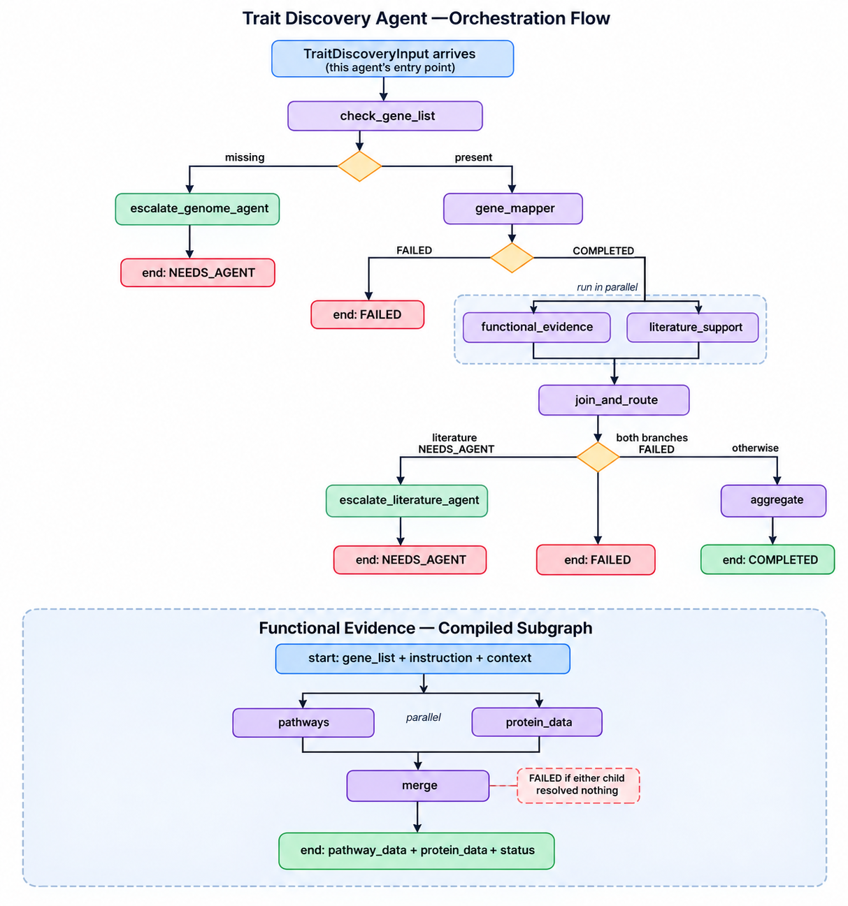

# Workflow — Trait Discovery Agent


## 1. Framework

**LangGraph.** The agent's own orchestrator and its Functional Evidence sub-orchestrator are both
`StateGraph`s — nodes are subagent calls (or small routing/aggregation steps), edges are the call
order, and conditional edges implement the `NEEDS_AGENT` / `FAILED` / `COMPLETED` routing contract
every agent card in this repo follows.


## 2. Graph shape



## 3. Nodes, in call order

| Node | What it does | Subagent called |
| --- | --- | --- |
| `check_gene_list` | Pulls `gene_list` out of `context`; this agent doesn't fetch genes itself | — |
| `escalate_genome_agent` | Terminal node when `gene_list` is missing | — |
| `gene_mapper` | Enriches the gene list with GO annotations | `mock_gene_mapper` |
| `pathways` (subgraph) | KEGG pathway lookup per gene | `mock_pathways_agent` |
| `protein_data` (subgraph) | UniProt protein lookup per gene, runs alongside `pathways` | `mock_protein_data_agent` |
| `merge` (subgraph) | Combines pathway + protein results, decides subgraph `status` | — |
| `literature_support` | Requests literature evidence, runs alongside the subgraph | `mock_literature_support` |
| `join_and_route` | No-op join point; both parallel branches land here before routing | — |
| `escalate_literature_agent` | Terminal node when literature evidence is too thin | — |
| `aggregate` | Builds the final plain-language explanation and `COMPLETED` output | — |
| `failed` | Terminal node for unrecoverable failures | — |

## 4. The escalation contract, in graph terms

Every subagent output carries `status`, `target_agent`, and `prompt_to_target_agent`. The graph
routes on `status` without inventing new meaning for it:

- **`NEEDS_AGENT`, dependency outside this agent** (Genome Agent for the gene list, Literature
Agent for deeper evidence) → a dedicated `escalate_*` node sets the final `status`/`target_agent`/
`prompt_to_target_agent` and the graph ends. Resuming means calling this agent again with the
missing data now present in `context` (e.g. `context["gene_list"]` populated).
- **`NEEDS_AGENT`, dependency inside this agent's own reach** — not currently exercised, since both
escalations here target external agents. A future "resolve dependency" resume node would only get
added if a subagent needed something the sub-orchestrator itself could resolve.
- **`FAILED` on something non-critical** (Functional Evidence alone, or Literature Support alone) →
the run continues; `join_and_route` only fails the whole graph if *both* parallel branches failed.
- **`FAILED` on something critical** (Gene Mapper resolves nothing) → routes straight to the
`failed` terminal node.
- **`CONTINUE`** is defined in `AgentStatus` but no node returns it yet — reserved for a future
multi-turn case.

## 5. Parallel execution

Two points in the graph run branches concurrently, using LangGraph's native fan-out/fan-in:

1. **Inside the Functional Evidence subgraph:** `pathways` and `protein_data` both start from the
subgraph's `START` and both feed into `merge`.
2. **Inside the top-level graph:** `functional_evidence` (the whole subgraph, invoked as a single
node) and `literature_support` both start after `gene_mapper` completes and both feed into
`join_and_route`.

## 6. Running it

```bash
# Local
python -m workflows

# Docker
docker build -t trait-discovery-agent:task3 .
docker run --rm --env-file .env trait-discovery-agent:task3 python -m workflows

# Tests
pytest tests/test_orchestrator.py -v  
pytest tests/test_workflows.py -v     
```

## 7. What's still mocked

Every subagent (`mock_gene_mapper`, `mock_pathways_agent`, `mock_protein_data_agent`,
`mock_literature_support`) is still the Task 1 mock — this workflow proves the *execution engine*
is correct, not that the real GO/KEGG/UniProt/Literature Agent integrations work yet. Swapping
mocks for real calls is Task 4+ and shouldn't require touching `trait_discovery_graph.py` or
`functional_evidence_graph.py` at all — only the subagent modules underneath them.